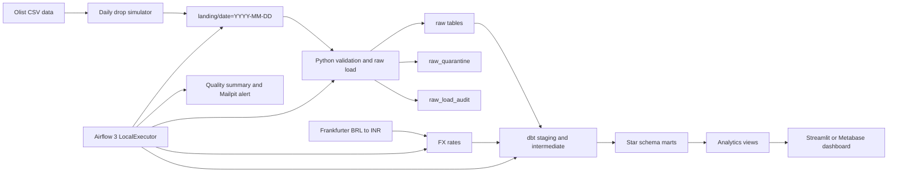

# ShopSight sales analytics pipeline

Build a local batch ELT pipeline that turns daily Olist CSV drops into tested PostgreSQL marts and a sales dashboard.

## Quick facts

| Item | Value |
|---|---|
| Track | Data Engineering — Batch |
| Difficulty | ★★★★☆ Upper-intermediate |
| Duration | 6 weeks, about 180 hours |
| Target job roles | Data Engineer, ETL Developer, Analytics Engineer, SQL Developer, BI Developer |
| Key skills | Python ingestion, PostgreSQL, dbt, Airflow 3, SQL analytics, data quality, Docker, CI |
| Prerequisites | Basic Python, basic SQL, Git basics, and willingness to learn Docker |
| Minimum hardware | 8 GB RAM with the lite profile |
| Student repository name | `shopsight` |

## What you will build

- A deterministic daily-drop simulator for the 9 Olist CSV files.
- A Python raw loader with validation, quarantine, audit, and reconciliation.
- Checksum and logical-date idempotency for safe reruns.
- BRL to INR exchange-rate ingestion with recorded test fixtures.
- A dbt warehouse with staging, intermediate, and star-schema marts.
- Required dbt tests, Python tests, coverage gates, and CI checks.
- An Airflow 3 daily DAG with sensors, retries, backfill, and alerts.
- Six analytics views and a four-chart sales dashboard.
- A runbook, data dictionary, dbt docs, and Olist licence attribution.

## Architecture at a glance

## How to read this specification

Read the documents in order for your first pass. Start with the overview, roles, requirements, and data model. Then read the pipeline, testing, setup, and delivery documents.

RFC 2119 keywords are used throughout. MUST means mandatory. SHOULD means recommended. MAY means optional.

Requirement IDs are stable. User stories use `US-NN`. Functional requirements use `FR-AREA-NN`. Business rules use `BR-NN`. Non-functional requirements use `NFR-CAT-NN`. Test cases use `TC-TYPE-NNN`.

## Document index

| Document | Purpose |
|---|---|
| [01 Project overview](docs/01-project-overview.md) | Business problem, goals, scope, assumptions, and success criteria. |
| [02 Users and roles](docs/02-users-and-roles.md) | Roles, personas, permissions, journeys, and user stories. |
| [03 Functional requirements](docs/03-functional-requirements.md) | Must, Should, Could behaviour and business rules. |
| [04 Non-functional requirements](docs/04-non-functional-requirements.md) | Performance, reliability, security, privacy, maintainability, and portability. |
| [05 System architecture](docs/05-system-architecture.md) | System diagrams, flows, deployment view, and ADR list. |
| [06 Tech stack and setup](docs/06-tech-stack-and-setup.md) | Versions, local setup, hardware profiles, accounts, and learning order. |
| [07 Data model](docs/07-data-model.md) | Source data, layers, marts, keys, constraints, and SCD rules. |
| [08 Pipeline specification](docs/08-pipeline-specification.md) | Jobs, tasks, schedules, dependencies, SLAs, idempotency, backfill, alerts. |
| [09 Testing strategy and test cases](docs/09-testing-strategy-and-test-cases.md) | Test strategy, catalog, traceability, coverage, and exit criteria. |
| [10 DevOps, CI/CD, and quality](docs/10-devops-ci-cd-and-quality.md) | Git workflow, CI jobs, quality tools, configuration, and Definition of Done. |
| [11 Milestones and deliverables](docs/11-milestones-and-deliverables.md) | Six-week plan, effort budget, final checklist, and demo script. |
| [12 Evaluation rubric](docs/12-evaluation-rubric.md) | Mandatory gates, weighted rubric, bonus, deductions, and viva questions. |
| [13 Interview preparation](docs/13-interview-preparation.md) | STAR pitch, interview questions, deep dives, fundamentals, and resume bullets. |
| [14 Glossary and resources](docs/14-glossary-and-resources.md) | Definitions, official links, learning resources, and reading order. |

## Rules for students

This is an individual project. You may discuss concepts with classmates, but your repository, code, tests, documentation, and demo must be your own work.

**AI assistant policy**

> You MAY use AI assistants (for example GitHub Copilot or ChatGPT) to learn concepts, explain errors, and review your code. You MUST understand every line that you commit. You MUST tell the trainer about significant AI help in the pull request description. You MUST NOT give this specification to an AI tool and submit the generated solution as your own work. In the viva, the trainer asks you to explain and change your code live. If you cannot explain your code, the result is "Rework required".

**How to ask questions**

> Open a GitHub Issue in this specification repository. Start the title with `[Question]`. The trainer answers in the issue, so all students can see the answer. If the answer changes the specification, the trainer updates the change log.

**Student repository**

> Create a public repository with the name `shopsight` in your own GitHub account. Add the trainer (`@sukurcf`) as a collaborator. Do not copy this specification into your repository. Link to it from your README.

**Review model**

> Every change goes through a pull request. You MAY merge your own pull request after CI is green and you complete the PR checklist. The trainer reviews at least 2 substantive pull requests from each student every week. The trainer can ask for changes at any time.

**Requirement freeze**

> This specification is frozen for the cohort. The trainer can add clarifications. If a change affects grading, the change log states the impact.

Weekly demo: every Friday, show 15 minutes of working progress, test evidence, and one current blocker or risk.

## Olist attribution

This specification uses the Olist Brazilian E-Commerce Public Dataset from Kaggle as non-commercial training data. Students MUST credit Olist and Kaggle and state the CC BY-NC-SA 4.0 licence in the student README and data dictionary. If Kaggle access fails, use synthetic data with the same schema and document the fallback.

## Change log

| Version | Date | Changes |
|---|---|---|
| 1.0 | 2026-10-02 | First release |
