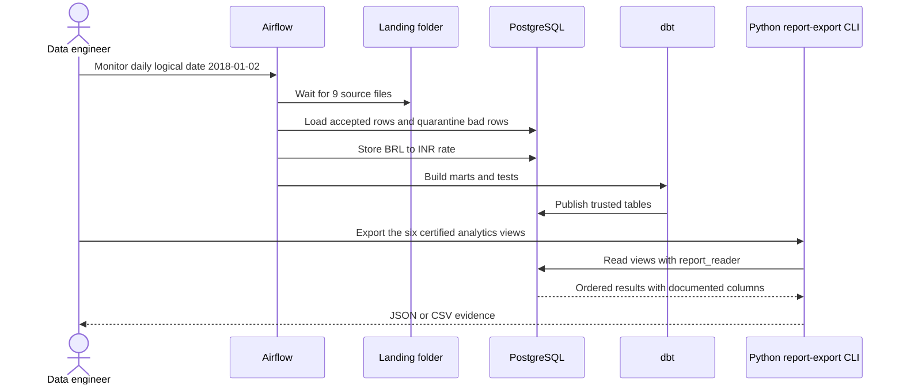
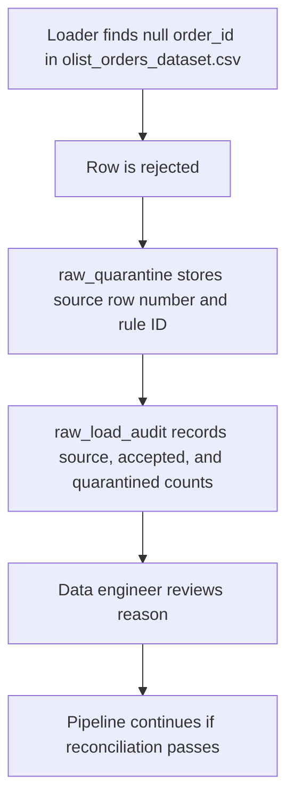
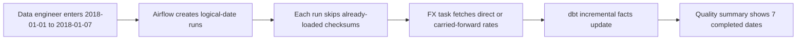

# Users and roles

Purpose: This document defines ShopSight roles, personas, permissions, journeys, and user stories.

## Roles

| Role | Type | Main responsibility |
|---|---|---|
| Data engineer | Human | Operate simulator, raw loads, Airflow runs, alerts, and backfills. |
| Analytics engineer | Human | Build dbt layers, marts, tests, and data documentation. |
| Data analyst | Human | Query marts and run read-only JSON/CSV report exports. |
| Head of Sales | Human | Consume exported sales, delivery, seller, and payment reports; no browser application is built. |
| Trainer | Human | Review PRs, demos, tests, ADRs, and viva answers. |
| Source systems | System | Generate synthetic Olist-equivalent files locally by default; real Olist is opt-in. |
| FX source | System | Supply recorded historical BRL to INR fixtures locally; Frankfurter is opt-in live mode. |
| CI system | System | Run checks with PostgreSQL and sample data. |

## Personas

| Persona | Role | Goals | Pain points | Technical comfort |
|---|---|---|---|---|
| Aditi Menon | Data engineer | Finish the daily run before the sales stand-up. Recover failed dates safely. | Duplicate CSV drops and unclear row-count mismatches slow her down. | High |
| Imran Shaikh | Analytics engineer | Publish trusted marts with clear grains and tests. | He worries that `customer_id` will overcount repeat customers. | High |
| Nisha Rao | Data analyst | Answer sales questions without manual spreadsheet joins. | She needs INR revenue and English product categories. | Medium |
| Meera Iyer | Head of Sales | Review daily GMV, late delivery, and payment mix from exported reports. | She needs documented columns and explicit BRL/INR units. | Low |

## Permission matrix

| Action | Data engineer | Analytics engineer | Data analyst | Head of Sales | Trainer | CI system |
|---|---|---|---|---|---|---|
| Generate local synthetic data or opt into Olist input | Yes | Yes | No | No | Review | Yes, synthetic only |
| Run daily-drop simulator | Yes | Yes | No | No | Yes | Yes |
| Load raw PostgreSQL tables | Yes | No | No | No | Review | Yes |
| View quarantine rows | Yes | Yes | Yes | No | Yes | Yes |
| Change dbt models | No | Yes | No | No | Review | No |
| Run dbt tests | Yes | Yes | No | No | Yes | Yes |
| Trigger Airflow backfill | Yes | No | No | No | Review | No |
| View marts | Yes | Yes | Yes | Yes | Yes | Yes |
| Run read-only report exports | Yes | Yes | Yes | No | Yes | Yes |
| Read exported JSON/CSV reports | Yes | Yes | Yes | Yes | Yes | Yes |
| Approve final submission | No | No | No | No | Yes | No |

## Journey 1: daily successful run

## Journey 2: bad-row recovery

## Journey 3: date-range backfill

## User stories

| ID | Story | Priority | Linked FR IDs |
|---|---|---|---|
| US-01 | As a data engineer, I want deterministic daily folders, so that I can reproduce the same training run. | Must | FR-SIM-01 |
| US-02 | As a data engineer, I want raw validation, quarantine, audit, and reconciliation, so that bad source rows do not pollute marts. | Must | FR-RAW-01 |
| US-03 | As a data engineer, I want checksum-based idempotency, so that a rerun does not duplicate accepted rows. | Must | FR-RAW-02 |
| US-04 | As a data engineer, I want BRL to INR rates for single dates and ranges, so that historical INR metrics are complete. | Must | FR-FX-01 |
| US-05 | As an analytics engineer, I want dbt staging, intermediate, and mart layers, so that transformations are understandable. | Must | FR-DBT-01 |
| US-06 | As an analyst, I want consistent money rules, so that GMV and freight totals match reports. | Must | FR-DBT-02 |
| US-07 | As an analytics engineer, I want generic, singular, freshness, and unit tests, so that mart defects stop the run. | Must | FR-DQ-01 |
| US-08 | As a data engineer, I want one Airflow daily DAG with retries and alerts, so that operations are repeatable. | Must | FR-ORCH-01 |
| US-09 | As a data analyst, I want 6 analytics views, so that common sales questions are answered from marts. | Must | FR-ANA-01 |
| US-10 | As the Head of Sales, I want exact JSON/CSV reports from the six views, so that I can review metrics produced locally on an 8 GB laptop. | Must | FR-REP-01 |
| US-11 | As a student, I want CI gates with sample data, so that each PR proves quality before review. | Must | FR-CI-01 |
| US-12 | As a trainer, I want data docs, a runbook, and licence notes, so that the project can be reviewed fairly. | Must | FR-DOC-01, FR-LIC-01 |
| US-13 | As a data engineer, I want configurable simulator problems, so that I can practise more failure scenarios. | Should | FR-SIM-02 |
| US-14 | As an analytics engineer, I want customer SCD Type 2, so that address changes can be analysed historically. | Should | FR-DBT-03 |
| US-15 | As a data analyst, I want extra retention and review-delay views, so that I can explore customer behaviour. | Should | FR-ANA-02 |
| US-16 | As a data engineer, I want a run quality report and performance evidence, so that weekly demos show reliability. | Should | FR-DQ-02 |
| US-17 | As a student, I want one local start/stop interface with offline seed data and persistent storage, so that I can reproduce the project on my own machine. | Must | FR-OPS-01 |

[Back to README](../README.md)
