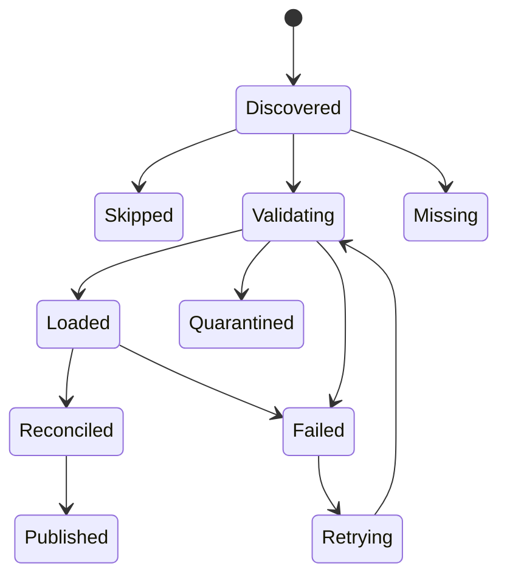
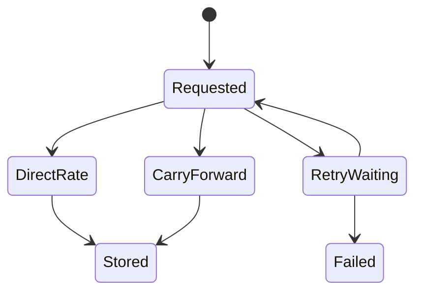

# Functional requirements

Purpose: This document defines ShopSight behaviour for simulation, ingestion, FX, transformations, quality, orchestration, analytics, Python report exports, local operation, CI, documentation, and licence compliance.

## Requirement summary

| ID | Title | Priority | Roles | Linked BRs |
|---|---|---|---|---|
| FR-SIM-01 | Create deterministic daily Olist drops | Must | Data engineer | BR-01, BR-02, BR-03, BR-21 |
| FR-RAW-01 | Validate, load, audit, quarantine, and reconcile raw files | Must | Data engineer | BR-02, BR-03, BR-04, BR-05, BR-06 |
| FR-RAW-02 | Enforce idempotency for file loads and logical dates | Must | Data engineer | BR-07, BR-08 |
| FR-FX-01 | Ingest BRL to INR exchange rates | Must | Data engineer | BR-09, BR-10, BR-11, BR-12 |
| FR-DBT-01 | Build dbt layers and star schema | Must | Analytics engineer | BR-13, BR-14, BR-15 |
| FR-DBT-02 | Apply money and payment reconciliation rules | Must | Analytics engineer, Data analyst | BR-16, BR-17, BR-18, BR-19 |
| FR-DQ-01 | Run required data-quality tests | Must | Analytics engineer | BR-20 |
| FR-ORCH-01 | Orchestrate the daily and backfill pipeline | Must | Data engineer | BR-08, BR-11, BR-22 |
| FR-ANA-01 | Publish 6 required analytics views | Must | Data analyst | BR-13, BR-16, BR-17, BR-23 |
| FR-REP-01 | Export the six views as exact JSON/CSV | Must | Head of Sales, Data analyst | BR-24 |
| FR-OPS-01 | Start, initialize, demonstrate, and stop locally | Must | Data engineer, Trainer | BR-25 |
| FR-CI-01 | Run CI with PostgreSQL and sample data | Must | Data engineer, Trainer | BR-20, BR-26 |
| FR-DOC-01 | Publish dbt docs, data dictionary, and runbook | Must | Data engineer, Analytics engineer | BR-27 |
| FR-LIC-01 | Document Olist licence, attribution, and synthetic local data | Must | Trainer, Data engineer | BR-21, BR-28 |
| FR-SIM-02 | Configure simulator problem rates and late updates | Should | Data engineer | BR-03, BR-08 |
| FR-DBT-03 | Add customer SCD Type 2 | Should | Analytics engineer | BR-14 |
| FR-ANA-02 | Publish review-delay and retention analytics | Should | Data analyst | BR-23 |
| FR-DQ-02 | Publish run quality report and performance evidence | Should | Data engineer | BR-20, BR-22 |
| FR-EXT-01 | Add local Parquet lake or extra quality tool | Could | Data engineer | BR-29 |
| FR-EXT-02 | Add locally captured lineage evidence | Could | Data engineer | BR-29 |

## Must requirements

### FR-SIM-01 — Create deterministic daily Olist drops

The simulator MUST locally generate synthetic Olist-equivalent historical data by default and split it by `order_purchase_timestamp` into `landing/date=YYYY-MM-DD/` folders. Real Olist CSV input is a separately selected source mode. It MUST use seed `20261002` for the default split and create all 9 source files for each logical date, even when a file has only its header for that day.

| Field | Value |
|---|---|
| Priority | Must |
| Roles | Data engineer |
| Linked BRs | BR-01, BR-02, BR-03, BR-21 |

Acceptance criteria:

1. Given locally generated Olist-equivalent data and seed `20261002`, when the simulator builds `landing/date=2018-01-02/`, then that folder contains exactly the 9 documented CSV file names.
2. Given two simulator runs with seed `20261002`, when row counts are compared for `olist_orders_dataset.csv`, then every logical date has the same count in both runs.
3. Given opt-in Olist input lacks `olist_products_dataset.csv`, when the simulator starts, then it stops before writing a partial date folder and reports `SIM-MISSING-SOURCE` without switching modes.
4. Given no internet or Kaggle files, when default synthetic mode runs after dependencies are installed, then it generates the same 9 file names, column names, and key relationships without attempting a download.

### FR-RAW-01 — Validate, load, audit, quarantine, and reconcile raw files

The raw loader MUST read one logical date folder and validate file names, column names, required values, types, and key formats. Accepted rows MUST load into PostgreSQL `raw` tables with `attempt_id`, `batch_id`, `logical_date`, `file_name`, `file_checksum`, and `loaded_at_utc`. Rejected rows MUST load into `raw_quarantine` with a rule ID, reason, file name, and source row number.

| Field | Value |
|---|---|
| Priority | Must |
| Roles | Data engineer |
| Linked BRs | BR-02, BR-03, BR-04, BR-05, BR-06 |

Acceptance criteria:

1. Given `landing/date=2018-01-02/` has 9 valid files, when the loader runs with `batch_id=20180102T000000Z`, then each accepted raw row stores that batch ID and its source file name.
2. Given one `olist_orders_dataset.csv` row has blank `order_id`, when validation runs, then that row is written to `raw_quarantine` with rule ID `VAL-ORDER-ID-REQUIRED`.
3. Given 100 source rows and 3 rejected rows for one file, when load audit is written, then `source_count=100`, `accepted_count=97`, and `quarantined_count=3`.
4. Given audit counts do not satisfy `source rows = accepted rows + quarantined rows`, when reconciliation runs, then the load status becomes `failed` and marts are not built.

### FR-RAW-02 — Enforce idempotency for file loads and logical dates

The loader MUST prevent duplicate accepted rows for the current committed file state. Each load attempt MUST get a separate attempt ID. A file MUST be skipped only when its checksum equals the current committed checksum for that logical date and file name. A rerun with changed file content MUST create a new attempt and replace only affected purchase-date partitions after validation succeeds.

| Field | Value |
|---|---|
| Priority | Must |
| Roles | Data engineer |
| Linked BRs | BR-07, BR-08 |

Acceptance criteria:

1. Given `olist_order_items_dataset.csv` for `2018-01-02` is committed with checksum `abc123`, when the same file is loaded again, then the new attempt status is `skipped` and accepted row count does not increase.
2. Given the same logical date has changed checksum `def456`, when validation succeeds, then the committed file state changes to `def456` and facts rebuild only affected purchase-date partitions.
3. Given a rerun fails during validation, when the previous successful rows exist, then the previous accepted rows remain available and the failed attempt is recorded separately.
4. Given the committed file changes from checksum `abc123` to `def456` and back to `abc123`, when both correction loads succeed, then the committed rows again match the original `abc123` source.

### FR-FX-01 — Ingest BRL to INR exchange rates

The FX task MUST use explicitly selected `fixture` or `live` mode. Default local mode reads committed recorded historical Frankfurter v2 responses with ECB provider rates. Live mode is opt-in and calls the official API. For a single date it MAY use `/v2/rate/brl/inr?date=YYYY-MM-DD&providers=ecb`. For a range it MUST use `/v2/rates?base=brl&quotes=inr&from=YYYY-MM-DD&to=YYYY-MM-DD&providers=ecb`. Both modes apply the same validation, provider, and carry-forward rules. Weekends and holidays MUST use the last available rate and set `is_carried_forward=true`.

| Field | Value |
|---|---|
| Priority | Must |
| Roles | Data engineer |
| Linked BRs | BR-09, BR-10, BR-11, BR-12 |

Acceptance criteria:

1. Given logical date `2018-01-02`, when the FX task reads its selected recorded/live source, then it stores base `BRL`, quote `INR`, provider `ecb`, `rate_date=2018-01-02`, and `is_carried_forward=false`.
2. Given live mode and date range `2018-01-01` to `2018-01-07`, when the FX task backfills rates, then it uses the Frankfurter time-series endpoint with `from=2018-01-01` and `to=2018-01-07`. Fixture mode reads the corresponding recorded range, including its preceding market-day seed, without HTTP.
3. Given `2018-01-01` has no market-day rate and `2017-12-29` has a rate, when the FX task stores `2018-01-01`, then `is_carried_forward=true` and `source_rate_date=2017-12-29`.
4. Given live mode and Frankfurter returns HTTP `422` for an invalid currency, when 2 retries are exhausted, then the task fails, sends an alert, and does not switch to fixtures or insert a fallback rate.
5. Given fixture mode and a required date or preceding seed is absent, when the FX task runs, then it fails and alerts with `FX-FIXTURE-MISSING`; it neither calls the API nor invents a rate.

### FR-DBT-01 — Build dbt layers and star schema

The dbt project MUST build staging, intermediate, and mart layers. Marts MUST include `fct_order_items`, `fct_orders`, `fct_order_payments`, `dim_customer`, `dim_product`, `dim_seller`, and `dim_date`. Facts MUST be incremental after the first historical backfill.

| Field | Value |
|---|---|
| Priority | Must |
| Roles | Analytics engineer |
| Linked BRs | BR-13, BR-14, BR-15 |

Acceptance criteria:

1. Given raw Olist tables exist, when dbt builds staging models, then source timestamps are typed as timestamps and money fields are typed as decimals.
2. Given product categories exist in Portuguese, when `dim_product` builds, then it exposes `product_category_name_english` from `product_category_name_translation.csv`.
3. Given `customer_unique_id=CUST-001` has two source `customer_id` values, when `dim_customer` builds in Must scope, then it creates one current customer row for `CUST-001`.
4. Given a fact model lacks a documented grain key, when dbt tests run, then the build fails before certified report export.

### FR-DBT-02 — Apply money and payment reconciliation rules

Marts MUST use decimal money values. GMV MUST equal item price totals. Freight MUST be reported separately. Each order MUST be classified as matched, within tolerance, or failed against the ±1% payment rule. Failed orders MUST be recorded in `dq_payment_exceptions` and excluded from certified financial views. Mart-level money outputs MUST round to 2 decimals only at the final output.

| Field | Value |
|---|---|
| Priority | Must |
| Roles | Analytics engineer, Data analyst |
| Linked BRs | BR-16, BR-17, BR-18, BR-19 |

Acceptance criteria:

1. Given an order has item prices `100.00` and `50.00`, when `fct_orders` builds, then `gmv_brl=150.00` and freight is not included in GMV.
2. Given the same order has freight values `10.00` and `5.00`, when `fct_orders` builds, then `freight_brl=15.00` in a separate column.
3. Given payment total is `166.00` and item plus freight total is `165.00`, when reconciliation runs, then status is `within_tolerance` because the difference is within ±1%.
4. Given payment total is `170.00` and item plus freight total is `165.00`, when reconciliation runs, then the order is recorded in `dq_payment_exceptions` and excluded from certified financial views.
5. Given mart output rounds money, when values `12.345` and `12.355` are formatted, then half-up rounding returns `12.35` and `12.36`.

### FR-DQ-01 — Run required data-quality tests

The project MUST run Python validation before raw load and dbt tests after transformations. dbt generic tests MUST cover all mart primary keys and foreign keys. At least 5 singular tests and at least 3 dbt unit tests MUST exist for business rules and complex models.

| Field | Value |
|---|---|
| Priority | Must |
| Roles | Analytics engineer |
| Linked BRs | BR-20 |

Acceptance criteria:

1. Given all staging, intermediate, and mart grain keys, when dbt tests run, then each key has both `unique` and `not_null` tests.
2. Given all fact-to-dimension keys, when dbt tests run, then each foreign key has a relationship test.
3. Given singular tests run, then at least 5 tests cover delivered date order, non-negative money, payment exception exclusion, carried-forward FX, and source-to-mart revenue totals.
4. Given CI runs without network access, when FX tests run, then they use recorded fixture files and do not call Frankfurter.

### FR-ORCH-01 — Orchestrate the daily and backfill pipeline

Airflow 3.x MUST orchestrate a daily DAG with LocalExecutor. The order MUST be wait for landing files, validate and load raw, read FX from the explicitly selected fixture/live source, run dbt source freshness, run dbt build, publish quality summary, and notify. Tasks MUST use 2 retries, a 5-minute retry delay, timeouts, and failure alerts. The default local DAG is initialized paused; demonstrations trigger historical logical dates explicitly, not uncontrolled catchup against today's date.

| Field | Value |
|---|---|
| Priority | Must |
| Roles | Data engineer |
| Linked BRs | BR-08, BR-11, BR-22 |

Acceptance criteria:

1. Given all 9 files exist for `2018-01-02`, when the DAG runs, then tasks execute in the documented dependency order.
2. Given `product_category_name_translation.csv` is missing, when the sensor reaches its timeout, then the run fails with the missing file name in the alert.
3. Given the FX task fails twice and then fails a third time, when retries are exhausted, then the DAG sends a Mailpit e-mail or webhook message with a stable run ID.
4. Given a backfill from `2018-01-01` to `2018-01-03`, when the command completes, then exactly 3 logical dates have completed audit records.

### FR-ANA-01 — Publish 6 required analytics views

The marts MUST expose 6 analytics views. At least 2 views MUST use SQL window functions. Views MUST answer monthly GMV, top 10 categories, delivery time versus estimate by state, late-delivery percentage, seller ranking, and payment-method mix.

| Field | Value |
|---|---|
| Priority | Must |
| Roles | Data analyst |
| Linked BRs | BR-13, BR-16, BR-17, BR-23 |

Acceptance criteria:

1. Given delivered orders in January 2018, when `mart_monthly_gmv` is queried, then it returns `month`, `order_count`, `item_count`, `gmv_brl`, `gmv_inr`, and `freight_brl`.
2. Given category GMV for a selected month, when `mart_top_categories` is queried, then it returns at most 10 categories ordered by `gmv_brl` descending.
3. Given seller monthly GMV, when `mart_seller_ranking` is queried, then it includes a window rank column named `seller_rank`.
4. Given an analytics view reads a raw table directly, when review runs, then the view is rejected because analytics must read marts.

### FR-REP-01 — Export the six views as exact JSON/CSV

The Python command `shopsight report export` MUST read only the six analytics views through a SELECT-only database user. It MUST return JSON or CSV using doc 08's exact columns, filters, ordering, decimal serialization, empty results, and exit codes. It MUST NOT reimplement SQL business calculations or read raw tables.

| Field | Value |
|---|---|
| Priority | Must |
| Roles | Head of Sales, Data analyst |
| Linked BRs | BR-24 |

Acceptance criteria:

1. Given the small fixture is built, when `--view mart_monthly_gmv --month 2018-01 --format json` is exported, then one row contains order count `7`, item count `9`, GMV BRL `"900.00"`, GMV INR `"17550.00"`, and freight BRL `"120.00"`.
2. Given each of the six views, when JSON and CSV exports are compared to SQL results, then columns and values match exactly; currency fields keep their `_brl`/`_inr` suffixes and no binary floats appear.
3. Given `--month 2019-01` has no rows, when the command runs, then JSON returns `row_count=0` and `rows=[]`, or CSV returns only its exact header, with exit `0`.
4. Given `--view raw_olist_orders` or unsupported `--state` filtering, when the command runs, then it exits `2` with `REPORT-INVALID-ARGUMENT` before SQL execution.
5. Given PostgreSQL is unavailable, when export runs, then it exits `3` with `LOCAL-DEPENDENCY-UNAVAILABLE` on stderr and writes no partial output.

### FR-OPS-01 — Start, initialize, demonstrate, and stop locally

The student MUST implement the single start and stop entry points in doc 06, idempotent database/Airflow initialization, fictional seed generation, health checks, offline demonstration, persistent volumes, and explicitly confirmed local reset. No paid account, API key, public hostname, cloud resource, or built-in console interaction is required.

| Field | Value |
|---|---|
| Priority | Must |
| Roles | Data engineer, Trainer |
| Linked BRs | BR-25 |

Acceptance criteria:

1. Given a clean clone with initial dependencies/images downloaded, when the doc 06 lite start entry point runs without internet, then PostgreSQL, Airflow components, and Mailpit are healthy on their fixed loopback ports. Start exits `0` and prints doc 06's exact healthy JSON with modes `synthetic` and `fixture`.
2. Given initialization completes, when the seeded demonstration runs, then source/accepted/quarantined totals are `63/60/3`, mart orders/items are `7/9`, and the exact monthly JSON/CSV exports match doc 08.
3. Given the demonstration completed, when stop then start runs, then committed checksums, raw counts, mart totals, and audit history survive; initialization does not reseed over existing data.
4. Given invalid profile or unavailable Docker/database, when a local command runs, then doc 08's error/exit contract applies; no destructive action occurs. Reset without `--confirm-delete-data` refuses with `LOCAL-RESET-CONFIRMATION-REQUIRED`.

### FR-CI-01 — Run CI with PostgreSQL and sample data

GitHub Actions MUST run on pull requests and pushes to `main`. CI MUST use a PostgreSQL service container and deterministic sample data with at most 1,000 rows per source table. CI MUST run lint, type checks, pytest, separate Python line/branch coverage gates, SQLFluff, DAG integrity, dbt build, JSON/CSV export snapshots, and the doc 09 local acceptance suite. Runtime acceptance tests use fixtures with external network blocked after dependency/image installation.

| Field | Value |
|---|---|
| Priority | Must |
| Roles | Data engineer, Trainer |
| Linked BRs | BR-20, BR-26 |

Acceptance criteria:

1. Given a pull request changes ingestion code, when CI runs, then Ruff, mypy, pytest, coverage, and PostgreSQL integration tests complete.
2. Given sample `olist_orders_dataset.csv` has 1,001 data rows, when CI data checks run, then CI fails with `CI-SAMPLE-ROW-LIMIT`.
3. Given Python line coverage is 84%, when CI evaluates coverage, then the build fails because the threshold is 85%.
4. Given a live HTTP request is attempted during CI FX tests, when network blocking is active, then the test fails and reports that fixtures are required.

### FR-DOC-01 — Publish dbt docs, data dictionary, and runbook

The student repository MUST include dbt documentation with lineage, a data dictionary, and a pipeline runbook. The runbook MUST cover local start/stop/reset, offline demonstration, daily run, backfill, missing files, quarantine review, explicit FX modes and failures, dbt test failure, and JSON/CSV exports.

| Field | Value |
|---|---|
| Priority | Must |
| Roles | Data engineer, Analytics engineer |
| Linked BRs | BR-27 |

Acceptance criteria:

1. Given the final repository, when the trainer opens the data dictionary, then it defines every mart table and analytics view.
2. Given an FX failure alert, when the runbook is followed, then it names where to find the selected mode, retries, fixture provenance when applicable, and failed logical date without prescribing a silent mode switch.
3. Given dbt docs are generated, when lineage is reviewed, then `fct_order_items` shows upstream raw or staging dependencies.

### FR-LIC-01 — Document Olist licence, attribution, and synthetic local data

The project MUST document that the Olist Brazilian E-Commerce Public Dataset comes from Kaggle and uses CC BY-NC-SA 4.0. The student MUST credit Olist and Kaggle as the schema reference, identify default locally generated fictional data, and distinguish it from opt-in real Olist input. Synthetic mode MUST use the same file names, column names, and key relationships.

| Field | Value |
|---|---|
| Priority | Must |
| Roles | Trainer, Data engineer |
| Linked BRs | BR-21, BR-28 |

Acceptance criteria:

1. Given the student README, when licence notes are reviewed, then it states Olist, Kaggle, CC BY-NC-SA 4.0, and non-commercial training use.
2. Given default local synthetic data is used, when the loader validates files, then all 9 files match the real Olist column names.
3. Given reports are exported, when the trainer asks for source attribution and mode, then the student can point to the README, data dictionary, and run configuration.

## Should and Could requirements

| ID | Description | Acceptance criteria |
|---|---|---|
| FR-SIM-02 | The simulator SHOULD allow configured duplicate, null, bad-date, bad-money, and late-status-update rates. | Given `duplicate_rate=0.02`, one seeded run creates the same duplicate row set each time. Given `late_update_rate=0.01`, only existing order IDs are updated. |
| FR-DBT-03 | `dim_customer` SHOULD support SCD Type 2 on city and state. | Given one `customer_unique_id` moves state on `2018-06-01`, facts before that date reference the old version and facts after it reference the new version. |
| FR-ANA-02 | The marts SHOULD expose review-score-versus-delay and repeat-customer retention views. | Given repeat buyers exist, the retention view returns `cohort_month`, `age_month`, `customers`, and `repeat_customer_rate`. |
| FR-DQ-02 | Each run SHOULD publish a Markdown, JSON, or CSV quality report and SHOULD record performance evidence. | Given a daily run completes, the report shows source, accepted, quarantined, dbt failures, and elapsed time. |
| FR-EXT-01 | The project MAY add a local Parquet lake or Great Expectations or Soda after Must work is complete. | Given all Must CI gates pass, the ADR explains added value and local resource cost. |
| FR-EXT-02 | The project MAY capture OpenLineage evidence locally after Must work is complete. | Given lineage is captured, the ADR explains its data-engineering value and offline resource budget; no frontend or cloud deployment is added. |

## Business rules

| BR ID | Exact rule | Exact values | Used by |
|---|---|---|---|
| BR-01 | Logical dates use `YYYY-MM-DD`. Machine event timestamps use UTC. | Example logical date `2018-01-02`; UTC suffix `Z`. | FR-SIM-01 |
| BR-02 | Daily landing folders use one fixed path format. | `landing/date=YYYY-MM-DD/` | FR-SIM-01, FR-RAW-01 |
| BR-03 | A complete daily drop contains the 9 real Olist CSV file names. | `olist_customers_dataset.csv`, `olist_geolocation_dataset.csv`, `olist_order_items_dataset.csv`, `olist_order_payments_dataset.csv`, `olist_order_reviews_dataset.csv`, `olist_orders_dataset.csv`, `olist_products_dataset.csv`, `olist_sellers_dataset.csv`, `product_category_name_translation.csv` | FR-SIM-01, FR-RAW-01, FR-SIM-02 |
| BR-04 | Raw accepted rows keep load metadata. | `attempt_id`, `batch_id`, `logical_date`, `file_name`, `file_checksum`, `loaded_at_utc`. | FR-RAW-01 |
| BR-05 | Quarantine rows keep rejection context. | Rule ID, reason, file name, source row number, raw payload. | FR-RAW-01 |
| BR-06 | Reconciliation is mandatory for every loaded file. | `source_count = accepted_count + quarantined_count`. | FR-RAW-01 |
| BR-07 | Duplicate-file checks use the current committed file state. | Skip only when logical date, file name, and checksum match the current committed state. Failed attempts never commit. | FR-RAW-02 |
| BR-08 | Idempotency is defined per logical date and current input. | Unchanged reruns keep counts and totals unchanged. Corrected inputs rebuild affected purchase-date partitions and remove missing fact keys. | FR-RAW-02, FR-ORCH-01 |
| BR-09 | FX base and quote are fixed for board revenue. | Base `BRL`; quote `INR`. | FR-FX-01 |
| BR-10 | Frankfurter v2 endpoint formats and recorded-response schemas are fixed. | Opt-in live single date `/v2/rate/brl/inr?date=YYYY-MM-DD&providers=ecb`; range `/v2/rates?base=brl&quotes=inr&from=YYYY-MM-DD&to=YYYY-MM-DD&providers=ecb`. Local fixture mode parses recorded responses without HTTP. | FR-FX-01 |
| BR-11 | FX failures do not silently fallback after retries fail. | 2 retries; failure alert after final failure. | FR-FX-01, FR-ORCH-01 |
| BR-12 | Closed-day rates must be flagged. | `is_carried_forward=true`; keep `source_rate_date`. | FR-FX-01 |
| BR-13 | Star schema mart names are fixed. | `fct_order_items`, `fct_orders`, `fct_order_payments`, `dim_customer`, `dim_product`, `dim_seller`, `dim_date`. | FR-DBT-01, FR-ANA-01 |
| BR-14 | Customer business key is fixed. | Use `customer_unique_id`; use `customer_id` only for source joins. | FR-DBT-01, FR-DBT-03 |
| BR-15 | Fact grains are fixed. | One row per order item; one row per order; one row per order payment sequence. | FR-DBT-01 |
| BR-16 | GMV excludes freight. | GMV is sum of `price`; freight is sum of `freight_value`. | FR-DBT-02, FR-ANA-01 |
| BR-17 | Money uses decimal types. | No floating point money values. | FR-DBT-02, FR-ANA-01 |
| BR-18 | Rounding happens only at mart output level. | Half-up rounding to 2 decimal places; examples `12.345` to `12.35` and `12.355` to `12.36`. | FR-DBT-02 |
| BR-19 | Payment reconciliation tolerance is fixed. | Orders outside ±1% go to `dq_payment_exceptions` and stay out of certified financial views. | FR-DBT-02 |
| BR-20 | Test minimums are fixed. | At least 50 meaningful cases, including 5 singular dbt tests and 3 dbt unit tests; 85% line and 75% branch coverage. | FR-DQ-01, FR-CI-01, FR-DQ-02 |
| BR-21 | Dataset licence and local-mode rules are fixed. | Olist Kaggle schema reference; CC BY-NC-SA 4.0; locally generated synthetic data is the explicit default with the same schema. | FR-SIM-01, FR-LIC-01 |
| BR-22 | Airflow retry values are fixed. | 2 retries; 5-minute retry delay. | FR-ORCH-01, FR-DQ-02 |
| BR-23 | Required analytics count is fixed. | 6 Must views; at least 2 with window functions. | FR-ANA-01, FR-ANA-02 |
| BR-24 | Report exports preserve all six view contracts. | JSON/CSV only, exact doc 08 columns and stable ordering, decimal strings, no-data exit `0`; invalid input exit `2`, dependency unavailable exit `3`. | FR-REP-01 |
| BR-25 | Local operation contract is fixed. | 8 GB four-core lite profile; doc 06 loopback ports, one start/stop entry point, initialization, offline seeded demo, persistent storage, and confirmed reset. RAM limits are proposed, not measured. | FR-OPS-01 |
| BR-26 | CI sample size is fixed. | At most 1,000 rows per source table. | FR-CI-01 |
| BR-27 | Documentation deliverables are fixed. | dbt docs, data dictionary, pipeline runbook. | FR-DOC-01 |
| BR-28 | Attribution must be visible. | Credit Olist and Kaggle in README and data dictionary. | FR-LIC-01 |
| BR-29 | Stretch work starts only after Must scope passes. | All Must CI gates green before Could work. | FR-EXT-01, FR-EXT-02 |

## State machines

### Raw file load state

| From | Event | Guard | To | Actor |
|---|---|---|---|---|
| Discovered | Duplicate detected | Incoming checksum equals current committed checksum | Skipped | Raw loader |
| Discovered | Start validation | 9 files found | Validating | Airflow |
| Validating | Valid rows loaded | Rejected rows stored | Loaded | Raw loader |
| Validating | All rows rejected | Quarantine written | Quarantined | Raw loader |
| Loaded | Count check passes | Source equals accepted plus quarantined | Reconciled | Raw loader |
| Reconciled | dbt starts | Reconciliation complete | Published | Airflow |
| Discovered | Sensor timeout | Any file missing | Missing | Airflow |
| Validating | Schema error | Required column missing | Failed | Raw loader |
| Loaded | Count mismatch | Reconciliation false | Failed | Raw loader |
| Failed | Retry available | Retry count less than 2 | Retrying | Airflow |

### FX rate state

| From | Event | Guard | To | Actor |
|---|---|---|---|---|
| Requested | Selected fixture/live source returns dated BRL INR rate | Rate date equals logical date | DirectRate | FX task |
| Requested | Selected source has no closed-day row | Earlier rate exists | CarryForward | FX task |
| Requested | HTTP 5xx or timeout | Retry count less than 2 | RetryWaiting | Airflow |
| RetryWaiting | Delay elapsed | 5 minutes passed | Requested | Airflow |
| RetryWaiting | Final retry failed | Retry count equals 2 | Failed | Airflow |
| DirectRate | Store row | Valid decimal rate | Stored | FX task |
| CarryForward | Store row | `source_rate_date` present | Stored | FX task |

## Validation rules

| Field | Rule | Error message or code |
|---|---|---|
| `order_id` | Required in orders, items, payments, and reviews. | `VAL-ORDER-ID-REQUIRED` |
| `customer_id` | Required in `olist_orders_dataset.csv` and customers source. | `VAL-CUSTOMER-ID-REQUIRED` |
| `customer_unique_id` | Required in customers source and used as business key. | `VAL-CUSTOMER-UNIQUE-REQUIRED` |
| `order_item_id` | Positive integer within an order. | `VAL-ORDER-ITEM-ID-POSITIVE` |
| `price` | Decimal greater than or equal to `0.00`. | `VAL-PRICE-NONNEGATIVE` |
| `freight_value` | Decimal greater than or equal to `0.00`. | `VAL-FREIGHT-NONNEGATIVE` |
| `payment_value` | Decimal greater than or equal to `0.00`. | `VAL-PAYMENT-NONNEGATIVE` |
| `order_purchase_timestamp` | Valid timestamp and present for every order. | `VAL-PURCHASE-TIMESTAMP` |
| `order_delivered_customer_date` | For delivered orders, not earlier than purchase timestamp. | `VAL-DELIVERY-BEFORE-PURCHASE` |
| `order_status` | One of documented Olist statuses. | `VAL-ORDER-STATUS` |
| `payment_type` | One of documented Olist payment types. | `VAL-PAYMENT-TYPE` |
| Source file header | Exact real Olist column names in documented order. | `VAL-SOURCE-SCHEMA` |

## Error scenarios

| Condition | System response | User-visible message or status |
|---|---|---|
| Landing folder missing | Sensor waits until timeout, then fails run. | `Missing landing/date=YYYY-MM-DD/` |
| One CSV file missing | Load does not start for that date. | `Missing required file: product_category_name_translation.csv` |
| Wrong column name | File is rejected before accepted rows load. | `VAL-SOURCE-SCHEMA` |
| Duplicate checksum | Loader records skipped audit status. | `Skipped already loaded file` |
| Bad row value | Row is stored in `raw_quarantine`. | Rule ID such as `VAL-PRICE-NONNEGATIVE` |
| Reconciliation mismatch | Load status becomes failed. | `RAW-RECONCILIATION-FAILED` |
| Frankfurter unavailable | Task retries twice and alerts after final failure. | `FX fetch failed after 2 retries` |
| dbt test failure | Publish is blocked. | Failing model or test name |
| Report view empty | JSON empty rows or CSV header only; exit `0`. | `row_count=0`, `rows=[]` for JSON |
| Invalid CLI argument | No SQL or destructive operation; exit `2`. | `REPORT-INVALID-ARGUMENT` or `LOCAL-INVALID-ARGUMENT` |
| Local dependency unavailable | Fail clearly without partial exports; exit `3`. | `LOCAL-DEPENDENCY-UNAVAILABLE` |
| Recorded FX date/seed missing | Fail and alert without network or mode switch. | `FX-FIXTURE-MISSING` |
| Reset not confirmed | Preserve all local data; exit `2`. | `LOCAL-RESET-CONFIRMATION-REQUIRED` |
| CI sample too large | CI fails before dbt build. | `CI-SAMPLE-ROW-LIMIT` |

[Back to README](../README.md)
