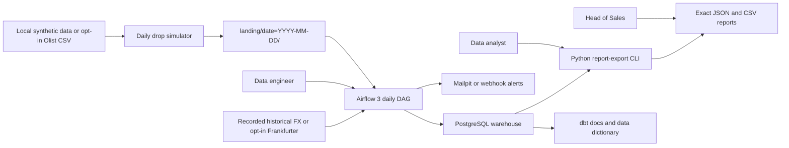
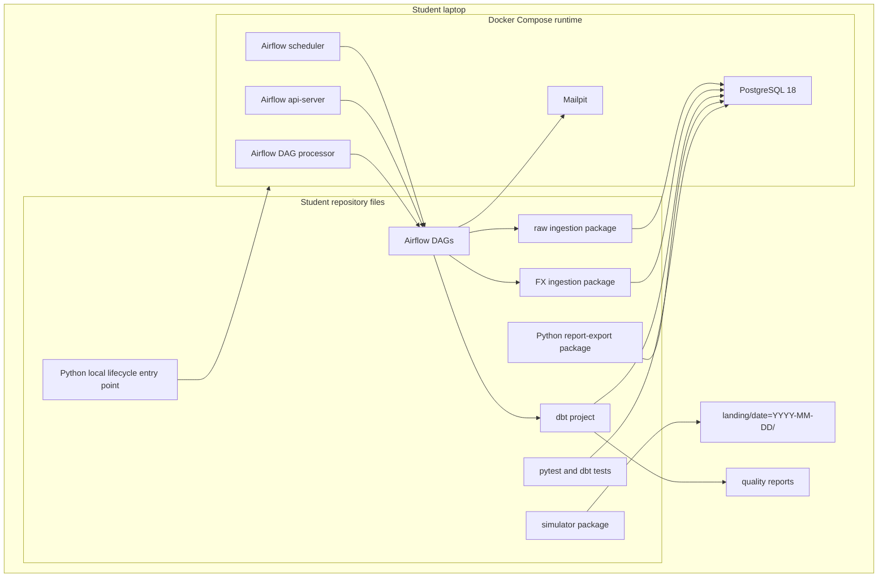
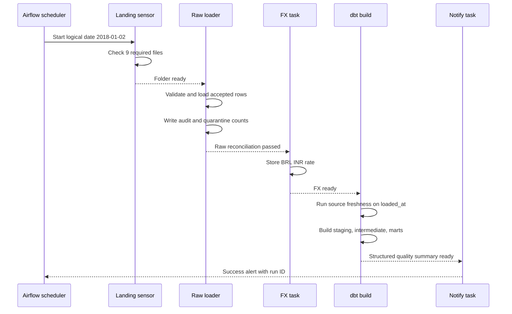
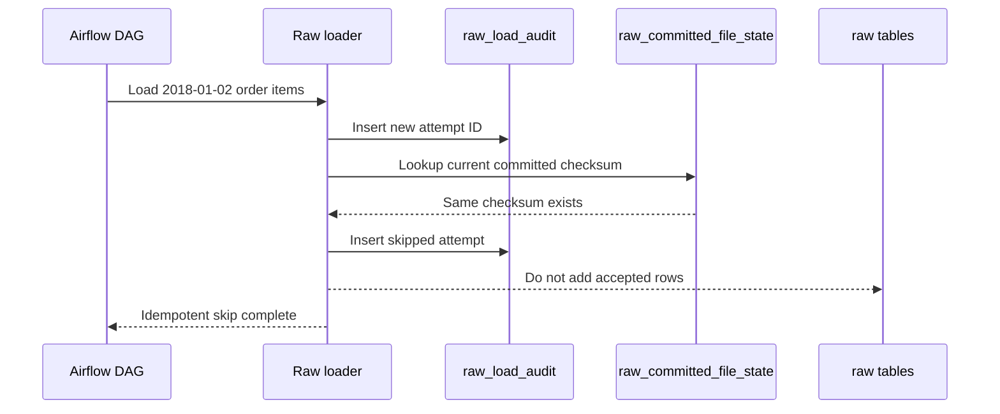
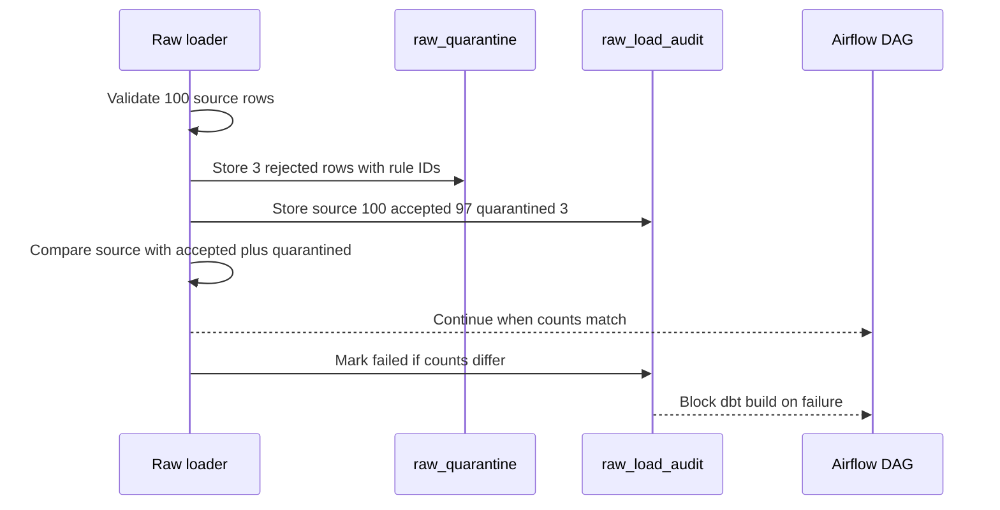
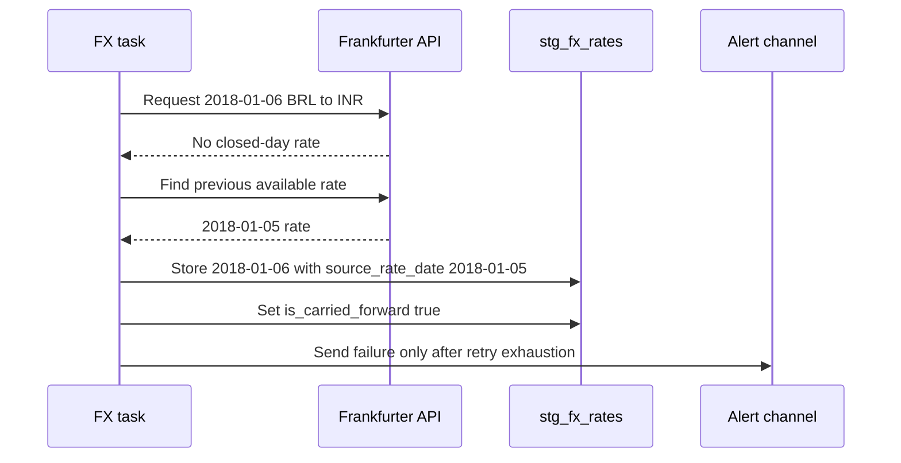
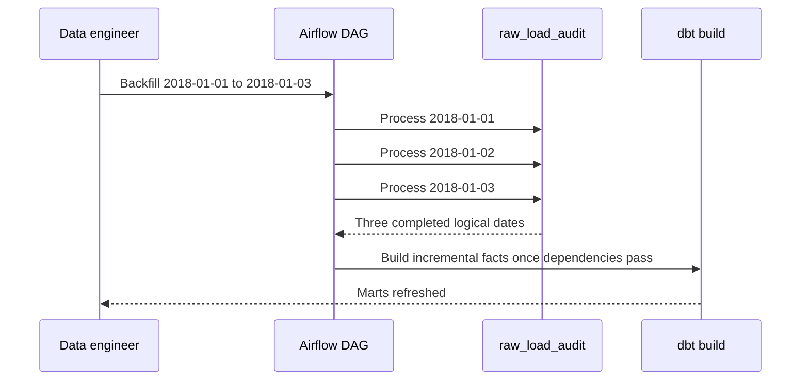

# System architecture

Purpose: This document shows how ShopSight moves local synthetic Olist-equivalent CSV drops into tested marts and Python JSON/CSV reports, with separate opt-in live sources.

## Context diagram



ShopSight is a local batch ELT system. The simulator creates deterministic daily folders. Airflow controls the load, FX, dbt build, quality summary, and notification steps. PostgreSQL stores raw, staging, intermediate, mart, audit, and quarantine data.

## Container and component diagram



The Airflow metadata database and the warehouse MAY share one local PostgreSQL container. They MUST use separate databases or schemas. Airflow uses LocalExecutor with scheduler, api-server, DAG processor, and metadata PostgreSQL. It MUST NOT require Celery workers, Redis, or a webserver service. A triggerer is optional on the standard profile for deferrable operators. Report access MUST be SELECT-only on the six analytics views. Built-in Airflow screens may be inspected only for operations.

## Key sequence diagrams

### Daily run



### Duplicate file rerun



### Quarantine and reconciliation failure



### Opt-in live FX carry-forward



### Backfill



## Data-flow description

1. The simulator generates synthetic Olist-equivalent source files locally by default, or reads real Olist files only in explicitly selected mode.
2. It writes daily folders under `landing/date=YYYY-MM-DD/`.
3. Each folder contains the 9 required CSV names.
4. The Airflow sensor waits for the complete folder.
5. The raw loader validates headers, required values, types, dates, and money values.
6. Accepted rows load into `raw_olist_*` tables with batch metadata.
7. Rejected rows load into `raw_quarantine` with the original payload and rule ID.
8. `raw_load_audit` stores counts, checksums, status, start time, and finish time.
9. The reconciliation check enforces `source_count = accepted_count + quarantined_count`.
10. The FX task reads the explicitly selected recorded historical fixture/live source and stores BRL to INR rates and carry-forward flags. Retry failure never changes source mode.
11. dbt builds staging, intermediate, fact, dimension, and analytics models.
12. The quality task publishes source counts, quarantine counts, dbt failures, and elapsed time.
13. The report CLI reads only the six analytics views and serializes their rows without changing SQL business definitions.

## Local deployment view

| Profile | Hardware | Services active together | Memory guidance |
|---|---:|---|---|
| Lite | 4 cores, 8 GB RAM | PostgreSQL, Airflow scheduler, Airflow api-server, Airflow DAG processor, Mailpit; short-lived report CLI | Airflow parallelism 1, max active runs 1, dbt threads 1; no student UI services. |
| Standard | 6 or more cores, 16 GB RAM | Same services; optional triggerer for deferrable operators | Use this profile for full backfill timing and Should scope. |

Windows users SHOULD use WSL2 memory `4GB`, swap `4GB`, processors `4` on an 8 GB laptop. They SHOULD use memory `8GB`, swap `4GB`, processors `6` on a 16 GB laptop. The trainer MUST validate the lite profile before week 1.

[Doc 06](06-tech-stack-and-setup.md) is authoritative for fixed loopback ports, start/stop/reset, storage, health, and proposed aggregate RAM budgets (`3136 MB` lite; `6528 MB` standard including optional triggerer). LocalExecutor child tasks are included in the scheduler budget. These are proposals, not measured results; trainer pre-check must measure the implemented profile.

## Expected student repository tree

```text
shopsight/
├── README.md
├── pyproject.toml
├── uv.lock
├── .env.example
├── data/
│   ├── sample/
│   └── fixtures/
│       └── fx/
├── landing/
├── src/
│   └── shopsight/
│       ├── simulator/
│       ├── ingestion/
│       ├── fx/
│       ├── quality/
│       ├── reports/
│       ├── local/
│       └── common/
├── airflow/
│   └── dags/
├── dbt/
│   ├── models/
│   │   ├── staging/
│   │   ├── intermediate/
│   │   └── marts/
│   ├── tests/
│   └── seeds/
├── tests/
│   ├── unit/
│   ├── integration/
│   ├── dag/
│   ├── cli/
│   ├── local/
│   └── reconciliation/
├── docs/
│   ├── adr/
│   ├── data-dictionary.md
│   └── runbook.md
└── reports/
```

The full Olist dataset MUST NOT be committed. The sample dataset MUST keep each source table at or below 1,000 rows.

## Design principles

| Principle | ShopSight meaning |
|---|---|
| Layered ELT | Keep landing, raw, staging, intermediate, marts, and report serialization separate. |
| Idempotent batches | A rerun for one logical date MUST not duplicate accepted rows or mart totals. |
| Audit before trust | Raw loads are trusted only after audit and reconciliation pass. |
| Decimal money | BRL and INR values use decimal types. Rounding happens only at mart output. |
| Local and free first | Must scope runs with Docker Compose on an 8 GB laptop. |
| Explicit local sources | Local runtime and CI use synthetic data and recorded FX by configuration; live failures never trigger a fallback. |
| Clear ownership | Python loads and exports data, dbt transforms data, Airflow orchestrates tasks, and reports only read analytics views. |

## ADR topics the student MUST write

| ADR ID | Decision topic | Exact question to answer |
|---|---|---|
| ADR-001 | DataFrame engine | Should ShopSight use pandas 3.0.x or Polars 1.44.x for simulator and ingestion work? |
| ADR-002 | Validation library | Should row validation use pandera 0.33.x schemas or Pydantic models at the ingestion boundary? |
| ADR-003 | Report export boundary | How will the Python CLI preserve view columns, decimal values, filter semantics, ordering, and read-only access? |
| ADR-004 | Customer history | Should `dim_customer` stay Type 1 for Must scope or add the Should SCD Type 2 snapshot? |
| ADR-005 | dbt execution in Airflow | Should Airflow call dbt as a command task or use an integration such as astronomer-cosmos? |
| ADR-006 | Explicit FX modes | How will recorded historical Frankfurter responses support offline local runs while opt-in live failures still fail and alert? |
| ADR-007 | Optional lake layer | Is a local Parquet or DuckDB layer worth the extra complexity after all Must gates pass? |

[Back to README](../README.md)
