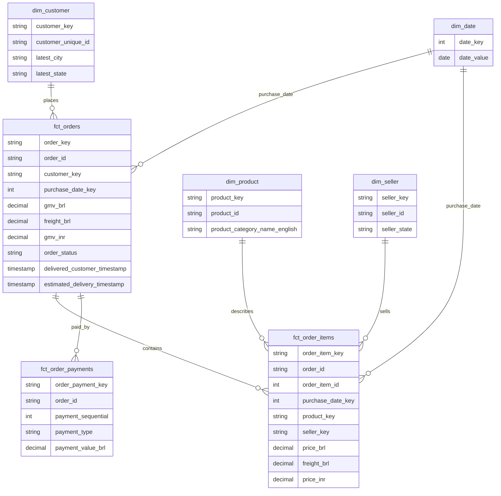

# Data model

Purpose: This document defines ShopSight source data, warehouse tables, relationships, data contracts, retention, and migration policy.

## Source dataset

| Item | Value |
|---|---|
| Dataset | Olist Brazilian E-Commerce Public Dataset |
| Official page | https://www.kaggle.com/datasets/olistbr/brazilian-ecommerce |
| Data volume | About 100,000 orders from 2016 to 2018 |
| Licence | CC BY-NC-SA 4.0 |
| Attribution | Credit Olist and Kaggle in README and data dictionary. |
| Fallback | Synthetic data with the same 9 file names, columns, keys, and value types. |

## Source files and columns

| File | Columns | Source key | Notes |
|---|---|---|---|
| `olist_customers_dataset.csv` | customer_id; customer_unique_id; customer_zip_code_prefix; customer_city; customer_state | `customer_id` | `customer_unique_id` is the business key. |
| `olist_geolocation_dataset.csv` | geolocation_zip_code_prefix; geolocation_lat; geolocation_lng; geolocation_city; geolocation_state | No natural unique key | Raw rows use batch ID, file name, and 1-based source row number. |
| `olist_order_items_dataset.csv` | order_id; order_item_id; product_id; seller_id; shipping_limit_date; price; freight_value | order_id plus order_item_id | Grain source for item fact. |
| `olist_order_payments_dataset.csv` | order_id; payment_sequential; payment_type; payment_installments; payment_value | order_id plus payment_sequential | Used for payment reconciliation. |
| `olist_order_reviews_dataset.csv` | review_id; order_id; review_score; review_comment_title; review_comment_message; review_creation_date; review_answer_timestamp | `review_id` plus `order_id` | Real `review_id` values can repeat. |
| `olist_orders_dataset.csv` | order_id; customer_id; order_status; order_purchase_timestamp; order_approved_at; order_delivered_carrier_date; order_delivered_customer_date; order_estimated_delivery_date | `order_id` | Order lifecycle source. |
| `olist_products_dataset.csv` | product_id; product_category_name; product_name_lenght; product_description_lenght; product_photos_qty; product_weight_g; product_length_cm; product_height_cm; product_width_cm | `product_id` | Keep real misspelled headers in landing and raw. Rename only in staging. |
| `olist_sellers_dataset.csv` | seller_id; seller_zip_code_prefix; seller_city; seller_state | `seller_id` | Seller dimension source. |
| `product_category_name_translation.csv` | product_category_name; product_category_name_english | `product_category_name` | Required for English category names. |

## Data layers

| Layer | Purpose | Owner | Mutability |
|---|---|---|---|
| Landing | Date-partitioned source files. | Simulator | Append-only for normal runs. |
| Raw | Accepted source rows with load metadata. | Ingestion | Idempotent against the current committed file state. |
| Quarantine | Rejected rows with reasons. | Ingestion | Append-only. |
| Staging | Standardized names, types, and source metadata. | dbt | Rebuilt or incremental. |
| Intermediate | Reusable joins and calculations. | dbt | Rebuilt or incremental. |
| Marts | Star schema and analytics views. | dbt | Trusted output. |
| Dashboard | Business presentation. | Data analyst | Reads marts only. |

## Core warehouse entities

### Operational and raw tables

| Table | Column | Logical type | Constraints | Description |
|---|---|---|---|---|
| `raw_load_audit` | `attempt_id` | string | Unique, required | Stable ID for one load attempt. |
| `raw_load_audit` | `batch_id` | string | Required | Logical batch identifier shown in logs and alerts. |
| `raw_load_audit` | `logical_date` | date | Required | Date processed by the run. |
| `raw_load_audit` | `file_name` | string | Required | Source CSV file name. |
| `raw_load_audit` | `file_checksum` | string | Required | File checksum used for idempotency. |
| `raw_load_audit` | `status` | enum | Required | Persisted audit status: `loaded`, `skipped`, `quarantined`, `reconciled`, or `failed`. |
| `raw_load_audit` | `source_count` | int | Non-negative | Source row count. |
| `raw_load_audit` | `accepted_count` | int | Non-negative | Accepted row count. |
| `raw_load_audit` | `quarantined_count` | int | Non-negative | Rejected row count. |
| `raw_quarantine` | `rule_id` | string | Required | Validation rule that rejected the row. |
| `raw_quarantine` | `source_row_number` | int | Required | Row number in the source CSV. |
| `raw_quarantine` | `raw_payload` | json | Required | Original row values. |
| `raw_olist_*` | source columns | source type | As source contract | Accepted rows from each Olist file. |
| `raw_committed_file_state` | `logical_date` | date | Required | Logical date for the current committed file. |
| `raw_committed_file_state` | `file_name` | string | Required | Source CSV file name. |
| `raw_committed_file_state` | `current_checksum` | string | Required | Checksum that is safe to skip on rerun. |
| `raw_committed_file_state` | `attempt_id` | string | Required | Successful attempt that committed this checksum. |
| `raw_olist_*` | load metadata | string and timestamp | Required | Attempt ID, batch ID, file name, checksum, load time. |

### Staging and intermediate tables

| Table | Column | Logical type | Constraints | Description |
|---|---|---|---|---|
| `stg_orders` | `order_id` | string | Not null | Source order key. |
| `stg_orders` | `customer_id` | string | Not null | Source join key. |
| `stg_orders` | `order_status` | enum | Accepted values | Olist order status. |
| `stg_orders` | `order_purchase_timestamp` | timestamp | Not null | Purchase time. |
| `stg_orders` | `order_delivered_customer_timestamp` | timestamp | Nullable | Delivered-to-customer timestamp. |
| `stg_orders` | `order_estimated_delivery_timestamp` | timestamp | Nullable | Promised delivery timestamp. |
| `stg_order_items` | `order_id` | string | Not null | Source order key. |
| `stg_order_items` | `order_item_id` | int | Positive | Item number inside an order. |
| `stg_order_items` | `product_id` | string | Not null | Source product key. |
| `stg_order_items` | `seller_id` | string | Not null | Source seller key. |
| `stg_order_items` | `price_brl` | decimal | Non-negative | Item price in BRL. |
| `stg_order_items` | `freight_brl` | decimal | Non-negative | Freight in BRL. |
| `stg_payments` | `order_id` | string | Not null | Source order key. |
| `stg_payments` | `payment_sequential` | int | Positive | Payment sequence inside an order. |
| `stg_payments` | `payment_type` | enum | Accepted values | Olist payment method. |
| `stg_payments` | `payment_value_brl` | decimal | Non-negative | Payment value in BRL. |
| `stg_fx_rates` | `rate_date` | date | Not null | Date used for BRL to INR conversion. |
| `stg_fx_rates` | `base_currency` | string | `BRL` | Source currency. |
| `stg_fx_rates` | `quote_currency` | string | `INR` | Reporting currency. |
| `stg_fx_rates` | `provider` | string | `ecb` | Frankfurter provider key. |
| `stg_fx_rates` | `rate` | decimal | Greater than 0 | BRL to INR rate. |
| `stg_fx_rates` | `is_carried_forward` | boolean | Required | True for weekend or holiday carry-forward. |
| `int_order_money` | `order_id` | string | Not null | Source order key. |
| `int_order_money` | `items_total_brl` | decimal | Required | Sum of item prices. |
| `int_order_money` | `freight_total_brl` | decimal | Required | Sum of freight. |
| `int_order_money` | `payment_total_brl` | decimal | Required | Sum of payments. |
| `int_order_money` | `reconciliation_status` | enum | Required | Payment match status. |

### Mart tables

| Table | Column | Logical type | Constraints | Description |
|---|---|---|---|---|
| `dim_date` | `date_key` | int | Unique, not null | Calendar key such as `20180102`. |
| `dim_date` | `date_value` | date | Unique, not null | Calendar date. |
| `dim_customer` | `customer_key` | string | Unique, not null | Surrogate or hashed key. |
| `dim_customer` | `customer_unique_id` | string | Unique in Must scope | Customer business key. |
| `dim_customer` | `latest_city` | string | Required when known | Latest customer city. |
| `dim_customer` | `latest_state` | string | Required when known | Latest customer state. |
| `dim_product` | `product_key` | string | Unique, not null | Product dimension key. |
| `dim_product` | `product_id` | string | Unique, not null | Source product key. |
| `dim_product` | `product_category_name_english` | string | Required when translated | English category name. |
| `dim_seller` | `seller_key` | string | Unique, not null | Seller dimension key. |
| `dim_seller` | `seller_id` | string | Unique, not null | Source seller key. |
| `dim_seller` | `seller_state` | string | Required when known | Seller state. |
| `fct_orders` | `order_key` | string | Unique, not null | Fact key. |
| `fct_orders` | `order_id` | string | Unique, not null | Source order key. |
| `fct_orders` | `customer_key` | string | Relationship test | Customer dimension key. |
| `fct_orders` | `order_status` | enum | Accepted values | Order status used by delivered-only marts. |
| `fct_orders` | `purchase_date_key` | int | Relationship test | Purchase date dimension key. |
| `fct_orders` | `delivered_customer_timestamp` | timestamp | Nullable | Delivered-to-customer timestamp. |
| `fct_orders` | `estimated_delivery_timestamp` | timestamp | Nullable | Promised delivery timestamp. |
| `fct_orders` | `gmv_brl` | decimal | 2 decimals at output | Sum of item prices. |
| `fct_orders` | `freight_brl` | decimal | 2 decimals at output | Freight amount. |
| `fct_orders` | `gmv_inr` | decimal | 2 decimals at output | GMV converted to INR. |
| `fct_order_items` | `order_item_key` | string | Unique, not null | Item fact key. |
| `fct_order_items` | `order_id` | string | Not null | Source order key. |
| `fct_order_items` | `order_item_id` | int | Positive | Item number inside an order. |
| `fct_order_items` | `purchase_date_key` | int | Relationship test | Purchase date dimension key. |
| `fct_order_items` | `product_key` | string | Relationship test | Product dimension key. |
| `fct_order_items` | `seller_key` | string | Relationship test | Seller dimension key. |
| `fct_order_items` | `price_brl` | decimal | Non-negative | Item price. |
| `fct_order_items` | `freight_brl` | decimal | Non-negative | Freight for the item. |
| `fct_order_items` | `price_inr` | decimal | 2 decimals at output | Item price in INR. |
| `fct_order_payments` | `order_payment_key` | string | Unique, not null | Payment fact key. |
| `fct_order_payments` | `order_id` | string | Relationship test | Source order key. |
| `fct_order_payments` | `payment_sequential` | int | Positive | Payment sequence inside an order. |
| `fct_order_payments` | `payment_type` | enum | Accepted values | Payment method. |
| `fct_order_payments` | `payment_value_brl` | decimal | Non-negative | Payment amount in BRL. |
| `dq_payment_exceptions` | `order_id` | string | Unique, not null | Order outside the ±1% payment tolerance. |
| `dq_payment_exceptions` | `difference_brl` | decimal | Required | Payment total minus item plus freight total. |

## Entity relationship diagram

## Required indexes and constraints

These are requirements, not SQL DDL.

| Object | Requirement |
|---|---|
| `raw_load_audit` | Keep every attempt as a separate row with a unique attempt ID. |
| `raw_committed_file_state` | Enforce one current committed checksum per logical date and file name. |
| Raw source tables | Keep source grain keys and load metadata for traceability. |
| `raw_quarantine` | Store batch ID, file name, source row number, rule ID, reason, and payload. |
| `stg_fx_rates` | Enforce one row per rate date, base currency, and quote currency. |
| `dim_customer` | Enforce one current row per `customer_unique_id` in Must scope. |
| `dim_product` | Enforce one row per `product_id`. |
| `dim_seller` | Enforce one row per `seller_id`. |
| `fct_orders` | Enforce one row per `order_id`. |
| `fct_order_items` | Enforce one row per `order_id` plus `order_item_id`. |
| `fct_order_payments` | Enforce one row per `order_id` plus `payment_sequential`. |
| `dq_payment_exceptions` | Exclude listed orders from certified financial views. |
| Analytics views | Document grain, filters, and output columns. |

## Enumerations

| Field | Allowed values |
|---|---|
| `order_status` | created; approved; invoiced; processing; shipped; delivered; canceled; unavailable |
| `payment_type` | credit_card; boleto; voucher; debit_card; not_defined |
| `currency` | `BRL`, `INR` |
| `audit_status` | loaded; skipped; quarantined; reconciled; failed |
| `workflow_state` | discovered; validating; loaded; quarantined; reconciled; published; missing; failed; retrying |
| `reconciliation_status` | `matched`, `within_tolerance`, `failed` |

## Sample data

| order_id | order_item_id | customer_unique_id | product_id | seller_id | price_brl | freight_brl | purchase_date |
|---|---:|---|---|---|---:|---:|---|
| `ORD-1001` | 1 | `CUST-501` | `PROD-101` | `SELL-77` | 120.00 | 18.50 | 2018-01-02 |
| `ORD-1002` | 1 | `CUST-502` | `PROD-102` | `SELL-78` | 89.90 | 12.00 | 2018-01-02 |
| `ORD-1002` | 2 | `CUST-502` | `PROD-103` | `SELL-79` | 40.00 | 6.00 | 2018-01-02 |

## Data contracts

| Contract | Requirement |
|---|---|
| Landing | A complete logical date folder has the 9 required Olist files. |
| Raw | Accepted rows keep source columns and load metadata. |
| Quarantine | Rejected rows have rule ID, reason, source row number, and raw payload. |
| FX | Each rate row has rate date, base, quote, decimal rate, source rate date, and carried-forward flag. |
| Mart | Each table states grain, keys, relationships, and half-up money rounding rule. |
| Analytics | Views read marts, not raw tables. |

## Partitioning and incrementality

Landing data is partitioned by `landing/date=YYYY-MM-DD/`. Orders are partitioned by purchase date. Items, payments, and reviews follow their `order_id`. Customers follow their `customer_id`. Products, sellers, geolocation, and category translations load once in a bootstrap step. Later daily folders keep header-only files for those bootstrap sources.

Load audit uses logical date, batch ID, and attempt ID. Fact models MUST be incremental after the historical backfill. Date filters for order facts MUST use purchase date. Corrected input rebuilds affected purchase-date partitions, removes fact keys that no longer exist, and recomputes order aggregates. Should-scope late status updates use deterministic simulator events.

## SCD rules

| Scope | Rule |
|---|---|
| Must | `dim_customer` is Type 1. It keeps one current row for each `customer_unique_id`. |
| Should | `dim_customer` becomes Type 2 for city and state. Facts reference the version valid at purchase time. |
| Could | Additional history rules MAY be added only after all Must work passes. |

## Retention

| Data | Retention requirement |
|---|---|
| CI sample data | Keep in the student repository. Keep each source table at or below 1,000 rows. |
| Full Olist data | Do not commit the full dataset. Store locally for training runs. |
| Raw accepted data | Keep for the project lifetime in local PostgreSQL. |
| Quarantine data | Keep for the project lifetime for debugging. |
| Audit data | Keep for the project lifetime for demo and viva evidence. |
| Dashboard extracts | Recreate from marts when possible. |

## Migration policy

- Version warehouse changes in the student repository.
- Update dbt docs and the data dictionary with each schema change.
- Keep sample data compatible with CI.
- Document breaking mart changes in the student CHANGELOG.
- Do not remove a mart column used by the dashboard without updating the dashboard and tests.

[Back to README](../README.md)
