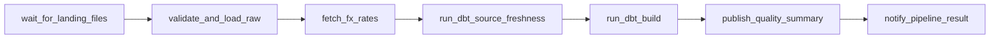

# Pipeline specification

Purpose: This document defines the ShopSight pipeline interfaces, schedules, tasks, data contracts, analytics outputs, alerts, backfills, and SLAs.

## Interface summary

| Interface item | Name | Main users | Requirement IDs |
|---|---|---|---|
| Landing zone | `landing/date=YYYY-MM-DD/` | Simulator, raw loader | FR-SIM-01, FR-RAW-01 |
| Simulator job | `simulate_daily_drops` | Data engineer | FR-SIM-01, FR-SIM-02 |
| Raw load job | `load_raw_logical_date` | Airflow DAG | FR-RAW-01, FR-RAW-02 |
| FX job | `fetch_brl_inr_rates` | Airflow DAG | FR-FX-01 |
| dbt job | `dbt_build_shopsight` | Airflow DAG | FR-DBT-01, FR-DBT-02, FR-DQ-01 |
| Quality job | `publish_quality_summary` | Airflow DAG | FR-DQ-01, FR-DQ-02 |
| Notify job | `notify_pipeline_result` | Airflow DAG | FR-ORCH-01 |
| Analytics views | 6 mart views | Analyst, dashboard | FR-ANA-01 |

## Landing-zone layout

| Rule | Exact value |
|---|---|
| Root | `landing/` |
| Daily folder | `landing/date=YYYY-MM-DD/` |
| Logical date example | `landing/date=2018-01-02/` |
| Encoding | UTF-8 |
| File format | CSV with header row |
| Required file count | 9 files in every complete daily folder |
| File-name match | Exact, case-sensitive |
| Empty daily source | Header-only file is allowed |

Required file names:

| File name | Required source key | Notes |
|---|---|---|
| `olist_customers_dataset.csv` | `customer_id` | Contains `customer_unique_id`. |
| `olist_geolocation_dataset.csv` | Batch ID, file name, and 1-based source row number in raw | No natural unique key. |
| `olist_order_items_dataset.csv` | `order_id` plus `order_item_id` | Source for item fact grain. |
| `olist_order_payments_dataset.csv` | `order_id` plus `payment_sequential` | Source for payment reconciliation. |
| `olist_order_reviews_dataset.csv` | `review_id` plus `order_id` | Real `review_id` values can repeat. |
| `olist_orders_dataset.csv` | `order_id` | Source for order lifecycle. |
| `olist_products_dataset.csv` | `product_id` | Uses real headers `product_name_lenght` and `product_description_lenght` until staging. |
| `olist_sellers_dataset.csv` | `seller_id` | Source for seller dimension. |
| `product_category_name_translation.csv` | `product_category_name` | Required for English categories. |

Example complete drop:

```text
landing/date=2018-01-02/
  olist_customers_dataset.csv
  olist_geolocation_dataset.csv
  olist_order_items_dataset.csv
  olist_order_payments_dataset.csv
  olist_order_reviews_dataset.csv
  olist_orders_dataset.csv
  olist_products_dataset.csv
  olist_sellers_dataset.csv
  product_category_name_translation.csv
```

## Simulator job interface

| Field | Value |
|---|---|
| Job name | `simulate_daily_drops` |
| Purpose | Split historical Olist rows into deterministic daily landing folders. |
| Main input | Full Olist dataset or synthetic fallback with the same schema. |
| Main output | `landing/date=YYYY-MM-DD/` folders. |
| Default seed | `20261002` |
| Required injected problems | fixed injection manifest after partitioning; duplicates, null required fields, bad dates, bad money values |
| Should injected problems | configurable rates and late status updates |
| Success status | `SIMULATED` |
| Failure status | `FAILED` |

Parameters:

| Name | Type | Required | Default | Rule |
|---|---|---|---|---|
| `source_dir` | path | Yes | None | Contains the 9 original CSV files. |
| `output_root` | path | Yes | `landing` | Creates date folders under this root. |
| `start_date` | date | No | Earliest order date | Format `YYYY-MM-DD`. |
| `end_date` | date | No | Latest order date | Format `YYYY-MM-DD`. |
| `seed` | integer | No | `20261002` | Same seed produces same split and same injected rows. |
| `fallback_mode` | enum | No | `false` | `false` or `synthetic`. |
| `duplicate_rate` | decimal | No | `0.00` | Should scope. Range `0.00` to `0.10`. |
| `null_rate` | decimal | No | `0.00` | Should scope. Range `0.00` to `0.10`. |
| `bad_date_rate` | decimal | No | `0.00` | Should scope. Range `0.00` to `0.05`. |
| `late_update_rate` | decimal | No | `0.00` | Should scope. Range `0.00` to `0.05`. |

Example operation:

```text
Operation: simulate_daily_drops
Input: source_dir=data/olist, output_root=landing, start_date=2018-01-01, end_date=2018-01-03, seed=20261002
Expected output: three folders named landing/date=2018-01-01/, landing/date=2018-01-02/, and landing/date=2018-01-03/
Expected status: SIMULATED
```

Simulator partitioning rules:

1. Orders are assigned to daily folders by purchase date.
2. Items, payments, and reviews follow the folder of their `order_id`.
3. Customers follow the folder of their `customer_id`.
4. Products, sellers, geolocation, and category translation load in a bootstrap step before daily drops.
5. Daily folders after bootstrap contain header-only files for bootstrap sources.
6. The fixed injection manifest is applied after partitioning, even when optional rates are `0.00`.
7. Later duplicate order keys or order-item keys go to quarantine with reason `VAL-DUPLICATE-SOURCE-KEY`.

Fixed injection manifest:

| Date | File | Target row or key | Mutation | Expected rejection code | Resulting count impact |
|---|---|---|---|---|---|
| 2018-01-02 | `olist_orders_dataset.csv` | Data row 8 | Set `order_id` to blank. | `VAL-ORDER-ID-REQUIRED` | 8 order source rows, 7 accepted orders, 1 quarantined order. |
| 2018-01-02 | `olist_order_items_dataset.csv` | Key `ORD-BAD-PRICE`, item 1 | Set `price` to `-1.00`. | `VAL-PRICE-NONNEGATIVE` | 10 item source rows, 9 accepted items, 1 quarantined item. |
| 2018-01-02 | `olist_order_payments_dataset.csv` | Payment row for `ORD-BAD-PAYMENT` | Set `payment_type` to `cash`. | `VAL-PAYMENT-TYPE` | 8 payment source rows, 7 accepted payments, 1 quarantined payment. |
| 2018-01-03 | `olist_orders_dataset.csv` | Duplicate key `ORD-DUP-001` | Repeat an existing order key in a later folder. | `VAL-DUPLICATE-SOURCE-KEY` | Duplicate row is quarantined and reconciliation still holds. |
| 2018-01-03 | `olist_order_items_dataset.csv` | Duplicate key `ORD-DUP-ITEM`, item 1 | Repeat an existing order-item key in a later folder. | `VAL-DUPLICATE-SOURCE-KEY` | Duplicate item row is quarantined and reconciliation still holds. |

The fixed manifest always applies after partitioning. Optional rates add extra seeded problems only when their value is greater than `0.00`.

## Airflow DAG specification

| Field | Exact value |
|---|---|
| DAG ID | `shopsight_daily_pipeline` |
| Runtime | Apache Airflow 3.3.x |
| Executor | LocalExecutor |
| Schedule | `0 2 * * *` |
| Time zone | `Asia/Kolkata` |
| Logical-date format | `YYYY-MM-DD` |
| Catchup | Enabled for controlled historical backfills |
| Default retries | 2 |
| Retry delay | 5 minutes |
| Max active runs | 1 in lite profile; 2 in standard profile |
| Tags | `shopsight`, `batch`, `dbt`, `postgres` |
| Owner | `data-engineering` |

Task table:

| Task ID | Purpose | Inputs | Outputs | Retries | Timeout | Idempotency key | Failure behaviour |
|---|---|---|---|---:|---|---|---|
| `wait_for_landing_files` | Wait for the 9 files for one logical date. | `landing/date=YYYY-MM-DD/` | File-ready signal | 2 | 20 minutes | Logical date plus required file list | Fail run and alert with missing file names. |
| `validate_and_load_raw` | Validate rows, load accepted rows, quarantine bad rows, and write audit counts. | 9 CSV files, logical date, batch ID | `raw_olist_*`, `raw_quarantine`, `raw_load_audit` | 2 | 30 minutes | Logical date, file name, checksum | Mark audit failed and block downstream tasks. |
| `fetch_fx_rates` | Fetch or backfill BRL to INR rates. | Logical date or date range | `stg_fx_rates` source table or raw FX table | 2 | 10 minutes | Rate date, base `BRL`, quote `INR` | Fail after retries and send alert. No silent fallback. |
| `run_dbt_source_freshness` | Run dbt source freshness before model build. | Raw tables, committed states, and FX rates | Freshness result | 2 | 10 minutes | dbt invocation ID and logical date | Fail before staging when sources are stale. |
| `run_dbt_build` | Build staging, intermediate, marts, tests, and analytics views. | Fresh raw tables and FX rates | dbt models and test results | 2 | 30 minutes | dbt invocation ID and logical date | Fail before dashboard refresh. |
| `publish_quality_summary` | Publish structured counts, status, failures, and elapsed time. | Audit rows and dbt artifacts | Structured quality summary; optional Markdown or HTML report | 2 | 10 minutes | Logical date and run ID | Mark summary as failed and alert. |
| `notify_pipeline_result` | Notify success or failure. | Run status, report path, failed task if any | Mailpit e-mail or webhook JSON | 2 | 5 minutes | Stable run ID | At-least-once alert with de-duplication key. |

Dependency order:



## Raw load contract

The raw loader validates each CSV before it trusts the data. A header mismatch rejects the whole file. A row-level value error sends only that row to quarantine.

Accepted row metadata:

| Field | Type | Required | Example |
|---|---|---|---|
| `batch_id` | string | Yes | `20180102T000000Z` |
| `attempt_id` | string | Yes | `attempt-20180102-001` |
| `logical_date` | date | Yes | `2018-01-02` |
| `file_name` | string | Yes | `olist_orders_dataset.csv` |
| `file_checksum` | string | Yes | `sha256:2a51...9fd1` |
| `loaded_at_utc` | timestamp | Yes | `2018-01-02T00:05:00Z` |

Quarantine row fields:

| Field | Type | Required | Example |
|---|---|---|---|
| `batch_id` | string | Yes | `20180102T000000Z` |
| `attempt_id` | string | Yes | `attempt-20180102-001` |
| `logical_date` | date | Yes | `2018-01-02` |
| `file_name` | string | Yes | `olist_orders_dataset.csv` |
| `source_row_number` | integer | Yes | `42` |
| `rule_id` | string | Yes | `VAL-ORDER-ID-REQUIRED` |
| `reason` | string | Yes | `order_id is required` |
| `raw_payload` | JSON object | Yes | Original row values |

Audit fields:

| Field | Type | Required | Example |
|---|---|---|---|
| `batch_id` | string | Yes | `20180102T000000Z` |
| `attempt_id` | string | Yes | `attempt-20180102-001` |
| `logical_date` | date | Yes | `2018-01-02` |
| `file_name` | string | Yes | `olist_orders_dataset.csv` |
| `file_checksum` | string | Yes | `sha256:2a51...9fd1` |
| `status` | enum | Yes | `reconciled` |
| `source_count` | integer | Yes | `100` |
| `accepted_count` | integer | Yes | `97` |
| `quarantined_count` | integer | Yes | `3` |
| `started_at_utc` | timestamp | Yes | `2018-01-02T00:00:00Z` |
| `finished_at_utc` | timestamp | Yes | `2018-01-02T00:03:00Z` |

Committed file-state fields:

| Field | Type | Required | Example |
|---|---|---|---|
| `logical_date` | date | Yes | `2018-01-02` |
| `file_name` | string | Yes | `olist_orders_dataset.csv` |
| `current_checksum` | string | Yes | `sha256:2a51...9fd1` |
| `attempt_id` | string | Yes | `attempt-20180102-001` |
| `committed_at_utc` | timestamp | Yes | `2018-01-02T00:03:30Z` |

A failed attempt MUST NOT update the committed file state. A file is skipped only when its checksum equals the current committed checksum.

Example quarantine payload:

```json
{
  "batch_id": "20180102T000000Z",
  "logical_date": "2018-01-02",
  "file_name": "olist_orders_dataset.csv",
  "source_row_number": 42,
  "rule_id": "VAL-ORDER-ID-REQUIRED",
  "reason": "order_id is required",
  "raw_payload": {
    "order_id": "",
    "customer_id": "CUST-100",
    "order_status": "delivered"
  }
}
```

## FX task rules

| Rule | Exact value |
|---|---|
| Base currency | `BRL` |
| Quote currency | `INR` |
| Provider | `ecb` |
| Single-date endpoint | `https://api.frankfurter.dev/v2/rate/brl/inr?date=YYYY-MM-DD&providers=ecb` |
| Range endpoint | `https://api.frankfurter.dev/v2/rates?base=brl&quotes=inr&from=YYYY-MM-DD&to=YYYY-MM-DD&providers=ecb` |
| Retries | 2 |
| Retry delay | 5 minutes |
| Failure rule | Fail the task and alert after retries. |
| CI rule | Use recorded fixture files. No live network request. |
| Weekend or holiday rule | Use last available ECB rate and set `is_carried_forward=true`. |
| Range seed rule | Seed a range with the preceding available rate when the first date is closed. |
| Rerun rule | Keep already committed rates unchanged on identical reruns. |

Stored FX fields:

| Field | Type | Required | Example |
|---|---|---|---|
| `rate_date` | date | Yes | `2018-01-06` |
| `base_currency` | string | Yes | `BRL` |
| `quote_currency` | string | Yes | `INR` |
| `provider` | string | Yes | `ecb` |
| `rate` | decimal | Yes | `19.5678` |
| `source_rate_date` | date | Yes | `2018-01-05` |
| `is_carried_forward` | boolean | Yes | `true` |
| `loaded_at_utc` | timestamp | Yes | `2018-01-06T02:05:00Z` |

Example carried-forward rate:

```json
{
  "rate_date": "2018-01-06",
  "base_currency": "BRL",
  "quote_currency": "INR",
  "provider": "ecb",
  "rate": "19.5678",
  "source_rate_date": "2018-01-05",
  "is_carried_forward": true
}
```

## dbt run stages and selectors

The student MUST describe selectors in dbt project terms. The spec names the stages, not SQL.

| Stage | Selector in words | Purpose | Failure behaviour |
|---|---|---|---|
| Source freshness | Explicit `dbt source freshness` step | Measure raw and FX `loaded_at_utc` timestamps, not 2018 purchase timestamps. Warn after 26 hours and error after 30 hours for daily sources. Static bootstrap sources are exempt from row-age freshness. |
| Source completeness | Committed-state check for all 9 files | Verify bootstrap sources have a successful bootstrap commit. Judge header-only daily files by `raw_committed_file_state.committed_at_utc`. Stop before staging if any file lacks a successful committed state. |
| Staging | All staging models and their tests | Standardize source names and types. | Stop before intermediate models. |
| Intermediate | Reusable join and money models | Build payment and GMV calculations. | Stop before marts. |
| Marts | Dimensions, facts, and analytics views | Publish trusted business tables. | Stop dashboard refresh. |
| Business tests | Generic, singular, and unit tests | Verify keys, relationships, money, FX, and revenue. | Mark run failed. |

dbt MUST build `stg_orders`, `stg_order_items`, `stg_payments`, `stg_fx_rates`, `int_order_money`, `dim_date`, `dim_customer`, `dim_product`, `dim_seller`, `fct_orders`, `fct_order_items`, `fct_order_payments`, and the 6 Must analytics views.

## Data-quality summary format

The Must quality summary is structured counts and status. The Should report MAY render the same data as Markdown or HTML. It MUST contain these fields.

| Field | Type | Example |
|---|---|---|
| `run_id` | string | `shopsight-20180102-001` |
| `logical_date` | date | `2018-01-02` |
| `status` | enum | `success`, `failed` |
| `source_rows` | integer | `100` |
| `accepted_rows` | integer | `97` |
| `quarantined_rows` | integer | `3` |
| `reconciliation_status` | enum | `passed`, `failed` |
| `dbt_models_built` | integer | `18` |
| `dbt_tests_failed` | integer | `0` |
| `elapsed_seconds` | integer | `240` |
| `report_path` | string, optional | `reports/quality/2018-01-02.md` |

Example summary:

```json
{
  "run_id": "shopsight-20180102-001",
  "logical_date": "2018-01-02",
  "status": "success",
  "source_rows": 100,
  "accepted_rows": 97,
  "quarantined_rows": 3,
  "reconciliation_status": "passed",
  "dbt_models_built": 18,
  "dbt_tests_failed": 0,
  "elapsed_seconds": 240,
  "report_path": "reports/quality/2018-01-02.md"
}
```

## Alert payloads

Alerts are at-least-once. Consumers MUST de-duplicate by `dedupe_key`.

Success payload:

```json
{
  "event_type": "shopsight.pipeline.success",
  "run_id": "shopsight-20180102-001",
  "dedupe_key": "shopsight_daily_pipeline:2018-01-02:success",
  "logical_date": "2018-01-02",
  "status": "success",
  "report_path": "reports/quality/2018-01-02.md",
  "finished_at_utc": "2018-01-02T02:04:00Z"
}
```

The `report_path` alert field is optional. It is present when the Should Markdown or HTML report is produced.

Failure payload:

```json
{
  "event_type": "shopsight.pipeline.failure",
  "run_id": "shopsight-20180102-002",
  "dedupe_key": "shopsight_daily_pipeline:2018-01-02:fetch_fx_rates:failed",
  "logical_date": "2018-01-02",
  "status": "failed",
  "failed_task_id": "fetch_fx_rates",
  "error_code": "FX-HTTP-RETRY-EXHAUSTED",
  "message": "FX fetch failed after 2 retries",
  "finished_at_utc": "2018-01-02T02:20:00Z"
}
```

## Backfill procedure

1. Confirm that `landing/date=YYYY-MM-DD/` folders exist for the full range.
2. Confirm that each folder contains the 9 required CSV files.
3. Run the Airflow backfill for the inclusive date range.
4. Use the range FX endpoint for BRL to INR rates where possible.
5. Keep `max_active_runs=1` on the lite profile.
6. Review `raw_load_audit` for each logical date.
7. Confirm that source rows equal accepted rows plus quarantined rows.
8. Run dbt build and tests after raw and FX tasks pass.
9. Publish one quality summary per logical date or one combined range summary.
10. If a date fails, fix only that date and rerun the same range.

Example backfill operation:

```text
Operation: shopsight_daily_pipeline backfill
Input: start_date=2018-01-01, end_date=2018-01-03, time_zone=Asia/Kolkata
Expected output: completed audit records for 2018-01-01, 2018-01-02, and 2018-01-03
Expected status: success when all three logical dates reconcile
```

## Run-time SLAs

| SLA | Target | Scope | Verification |
|---|---:|---|---|
| Daily run | Less than 5 minutes | One representative logical date after setup | Timed Airflow run |
| Full backfill | Less than 30 minutes | About 100,000 Olist orders on standard profile | Timed local demo |
| Sensor wait | 20 minutes before failure | One logical date folder | DAG task log |
| CI run | 15 minutes or less | Pull request with sample data | GitHub Actions duration |
| Alert delivery | Within 1 minute after terminal task state | Mailpit or webhook | Alert timestamp |

## Required analytics questions

The student MUST implement these as SQL views. This document defines each question. It does not give SQL.

Certified financial views MUST exclude order IDs listed in `dq_payment_exceptions`. Tests compare staging totals and reporting totals over the same eligible population.

### 1. Monthly GMV

| Field | Definition |
|---|---|
| View name | `mart_monthly_gmv` |
| Business question | What are monthly order count, GMV, freight, and INR revenue trends? |
| Grain | One row per purchase month. |
| Filters | Include delivered orders. Exclude orders without item rows. |
| Metrics | GMV is sum of item prices. Freight is separate. INR uses BRL to INR rate for purchase date. |
| Output columns | `month`, `order_count`, `item_count`, `gmv_brl`, `gmv_inr`, `freight_brl` |

### 2. Top 10 categories

| Field | Definition |
|---|---|
| View name | `mart_top_categories` |
| Business question | Which English product categories produce the highest GMV? |
| Grain | One row per purchase month and English category. |
| Filters | Include delivered orders. Keep at most 10 categories per month. |
| Metrics | `category_rank` ranks categories by `gmv_brl` within each month. |
| Output columns | `month`, `category_rank`, `product_category_name_english`, `order_count`, `item_count`, `gmv_brl`, `gmv_inr` |

### 3. Delivery time versus estimate by state

| Field | Definition |
|---|---|
| View name | `mart_delivery_state` |
| Business question | Which customer states receive orders later or earlier than the estimate? |
| Grain | One row per purchase month and customer state. |
| Filters | Include delivered orders with purchase, delivered, and estimated dates. |
| Metrics | Actual delivery days is delivered date minus purchase date. Estimate variance is delivered date minus estimated date. |
| Output columns | `month`, `customer_state`, `delivered_order_count`, `avg_delivery_days`, `avg_days_vs_estimate`, `late_order_count` |

### 4. Late-delivery percentage

| Field | Definition |
|---|---|
| View name | `mart_late_delivery` |
| Business question | What percent of delivered orders arrived after the estimated date? |
| Grain | One row per purchase month and customer state. |
| Filters | Include delivered orders with delivered and estimated dates. |
| Metrics | Late delivery percent equals late delivered orders divided by delivered orders times 100. |
| Output columns | `month`, `customer_state`, `delivered_order_count`, `late_order_count`, `late_delivery_pct` |

### 5. Seller ranking

| Field | Definition |
|---|---|
| View name | `mart_seller_ranking` |
| Business question | Which sellers rank highest by monthly GMV? |
| Grain | One row per purchase month and seller. |
| Filters | Include delivered orders. |
| Metrics | `seller_rank` is a window rank within each month by `gmv_brl` descending. |
| Output columns | `month`, `seller_rank`, `seller_id`, `seller_state`, `order_count`, `item_count`, `gmv_brl`, `gmv_inr` |

### 6. Payment-method mix

| Field | Definition |
|---|---|
| View name | `mart_payment_mix` |
| Business question | What share of revenue comes from each payment method? |
| Grain | One row per purchase month and payment type. |
| Filters | Include payments linked to accepted orders. |
| Metrics | Payment share percent equals payment value for the method divided by total monthly payment value times 100. |
| Output columns | `month`, `payment_type`, `payment_order_count`, `payment_value_brl`, `payment_share_pct` |

## Error formats

Pipeline errors MUST use a stable code and clear context.

```json
{
  "error_code": "RAW-RECONCILIATION-FAILED",
  "message": "source_count does not equal accepted_count plus quarantined_count",
  "logical_date": "2018-01-02",
  "file_name": "olist_orders_dataset.csv",
  "batch_id": "20180102T000000Z"
}
```

| Error code | Meaning | Terminal state |
|---|---|---|
| `SIM-MISSING-SOURCE` | A required source CSV is missing before simulation. | Failed simulator job |
| `VAL-SOURCE-SCHEMA` | A CSV header differs from the documented contract. | Failed raw load |
| `VAL-ORDER-ID-REQUIRED` | A row has blank `order_id`. | Quarantined row |
| `RAW-RECONCILIATION-FAILED` | Audit counts do not balance. | Failed raw load |
| `FX-HTTP-RETRY-EXHAUSTED` | Frankfurter failed after 2 retries. | Failed FX task |
| `DBT-TEST-FAILED` | dbt returned failing tests. | Failed dbt task |
| `CI-SAMPLE-ROW-LIMIT` | A CI sample source file has more than 1,000 data rows. | Failed CI |

[Back to README](../README.md)
