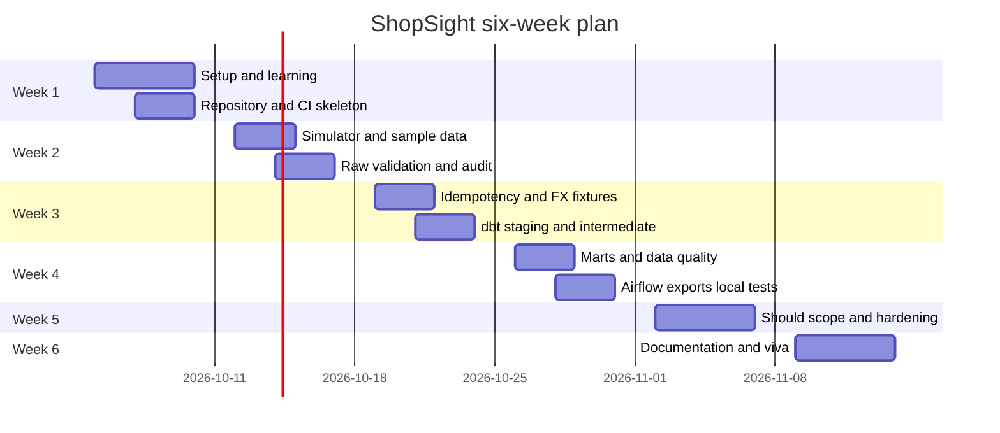

# Milestones and deliverables

Purpose: This document gives the six-week ShopSight plan, effort budget, final checklist, submission process, and demo script.

## Effort budget

The total budget is about 180 hours. Must work is about 120 hours, including about 30 hours of learning and setup. Should, Could, hardening, interview practice, and contingency use the remaining 60 hours.

Version 1.1 reallocates removed frontend work to Python report serialization, SQL contracts, and offline local reliability. No UI or cloud-deployment exercise remains, including bonus work; the six-week/hour totals are unchanged.

| Feature area | Requirement IDs | Must hours | Later hours | Notes |
|---|---|---:|---:|---|
| Learning, setup, Git workflow | FR-CI-01, FR-OPS-01 | 30 | 4 | Covers Docker, PostgreSQL, dbt, Airflow, local start/stop/migrations, and CI basics. |
| Daily-drop simulator and sample data | FR-SIM-01, FR-SIM-02 | 10 | 5 | Seed `20261002`, 9 files, and problem injection. |
| Raw ingestion, validation, quarantine, audit | FR-RAW-01, FR-RAW-02 | 18 | 4 | Includes reconciliation and rerun safety. |
| Exchange-rate ingestion | FR-FX-01 | 8 | 2 | Recorded historical FX is explicit local default; live mode fails/alerts without fallback. |
| dbt warehouse and marts | FR-DBT-01, FR-DBT-02, FR-DBT-03 | 20 | 10 | Must uses Type 1 customer. Should adds Type 2. |
| Data quality and tests | FR-DQ-01, FR-DQ-02 | 10 | 8 | Includes 5 singular tests and 3 dbt unit tests. |
| Airflow orchestration and alerts | FR-ORCH-01 | 10 | 4 | Daily DAG, backfill, retries, Mailpit or webhook. |
| Analytics views, Python exports, local reliability | FR-ANA-01, FR-REP-01, FR-OPS-01, FR-ANA-02 | 8 | 8 | Six views, exact JSON/CSV, local acceptance tests, two Should views. |
| CI, security, docs, runbook, licence | FR-CI-01, FR-DOC-01, FR-LIC-01 | 6 | 10 | Includes Olist and Kaggle attribution. |
| Performance, polish, viva, contingency | NFR-PERF-01, NFR-PERF-02 | 0 | 5 | Time boxed after Must scope passes. |
| **Total** |  | **120** | **60** | **180 hours** |

## Week-by-week plan

| Week | Goals | Tasks with IDs | Deliverables | Friday demo checkpoint |
|---|---|---|---|---|
| 1 | Set up tools and design the first slice. | Create `shopsight`, branch protection, local lifecycle, sample data plan, ADRs for report serialization and data frame tool. Read FR-SIM-01, FR-RAW-01, FR-CI-01, FR-OPS-01. | Repository skeleton, CI skeleton, `.env.example`, first ADRs, synthetic seed plan. | Show loopback services and health CLI, plus one CI check. |
| 2 | Build deterministic input and raw loading. | Implement seeded daily folders for FR-SIM-01. Validate 9 files for FR-RAW-01. Add quarantine and audit counts. | Simulator, raw tables, quarantine examples, unit tests. | Show `landing/date=2018-01-02/` and one quarantined bad row. |
| 3 | Add idempotency, FX, and early dbt layers. | Finish FR-RAW-02. Add Frankfurter fixtures for FR-FX-01. Create staging and intermediate models for FR-DBT-01. | Rerun test, FX fixture tests, staging docs. | Run the same logical date twice with unchanged input checksums and prove counts do not change. |
| 4 | Complete Must pipeline, Python exports, local acceptance, and documentation. | Finish facts, dimensions, money rules, dbt tests, Airflow DAG, 6 views, JSON/CSV CLI, offline demo, restart/failure tests, dbt docs, data dictionary, runbook, and licence notes. Cover FR-DBT-02, FR-DQ-01, FR-ORCH-01, FR-ANA-01, FR-REP-01, FR-OPS-01, FR-DOC-01, FR-LIC-01. | End-to-end offline sample run, dbt/DAG evidence, six-view snapshots, TC-LOCAL-001 through TC-LOCAL-004, required docs. | Show DAG dependency evidence, exact `900.00/17550.00` exports, persisted restart, and attribution; no console is required. |
| 5 | Harden and add selected Should items. | Add Markdown/JSON/CSV quality report, performance evidence, SCD Type 2 if chosen, extra analytics, and CLI help/error edge cases. Cover FR-DQ-02, FR-DBT-03, FR-ANA-02 where selected. | Quality report, timed run logs, updated ADRs, polished docs. | Show one failure recovery and performance evidence. |
| 6 | Prepare final submission and viva. | Polish runbook, data dictionary, README, demo video, final tag, and mock interview. Re-verify FR-DOC-01 and FR-LIC-01. | Final `v1.0.0` tag, clean CI, demo video, viva notes. | Deliver 10-minute final demo rehearsal. |

## Gantt chart

## Final deliverables checklist

| Deliverable | Required evidence |
|---|---|
| Public GitHub repository `shopsight` | Trainer `@sukurcf` is a collaborator. |
| README | Doc 06 start/stop/confirmed reset, ports, offline demo, Olist attribution, and exact JSON/CSV examples. |
| Architecture diagram | Shows landing, raw, dbt, marts, Airflow, report CLI, explicit source modes, and Mailpit. |
| ADRs | At least 5 ADRs, including report serialization, data frame engine, dbt v2 if used, SCD Type 2 if used, and alerting. |
| Test and coverage report | At least 50 meaningful tests, 85% line and 75% branch coverage, dbt output, six-view snapshots, and TC-LOCAL-001 through TC-LOCAL-004. |
| Airflow evidence | DAG dependency/import evidence, successful daily run, backfill, and failed alert from logs/API; built-in console inspection is optional operations only. |
| dbt docs | Generated lineage and model descriptions. |
| Data dictionary | Tables, grains, keys, money rules, and Olist attribution. |
| Pipeline runbook | Local start/stop/reset, offline demo, daily run, backfill, missing files, quarantine, explicit FX failures, dbt failure, JSON/CSV exports. |
| Demo video | Maximum 5 minutes. Shows terminal setup, pipeline, quality, exports, and persistence; no student frontend. |
| Final tag | `v1.0.0` on the submitted commit. |

## Submission process

1. Confirm CI is green on `main`.
2. Confirm no secrets are present in Git history.
3. Tag the final commit as `v1.0.0`.
4. Add the demo video link to the student README.
5. Open a final GitHub Issue titled `[Submission] ShopSight final review`.
6. Include the repository link, tag, CI run link, demo video link, and known limitations.
7. Do not change the submission after the trainer starts evaluation unless asked.

## 10-minute final demo script

| Minute | What to show | Requirements covered |
|---:|---|---|
| 0-1 | State the problem, Olist source, CC BY-NC-SA 4.0 attribution, and BRL to INR need. | FR-LIC-01 |
| 1-2 | Show repository layout, ADRs, `.env.example`, and CI status. | FR-CI-01, FR-DOC-01 |
| 2-3 | Show `landing/date=2018-01-02/` with 9 files and the seed `20261002`. | FR-SIM-01 |
| 3-4 | Run or show raw load evidence with audit counts and one quarantine row. | FR-RAW-01 |
| 4-5 | Rerun the same logical date and show skipped checksum or unchanged totals for unchanged input. | FR-RAW-02 |
| 5-6 | Show FX fixture use, carried-forward flag, and failure alert example. | FR-FX-01, FR-ORCH-01 |
| 6-7 | Show dbt lineage, facts, dimensions, tests, and money reconciliation. | FR-DBT-01, FR-DBT-02, FR-DQ-01 |
| 7-8 | Show Airflow DAG order and a 3-day backfill audit. | FR-ORCH-01 |
| 8-9 | Export the 6 analytics views; compare monthly JSON/CSV to `900.00` BRL and `17550.00` INR fixture totals. | FR-ANA-01, FR-REP-01 |
| 9-10 | Show persisted stop/start and a clear dependency error using TC-LOCAL evidence; explain one defect and point to runbook/data dictionary. | FR-OPS-01, FR-DOC-01, NFR-MAINT-01, NFR-OBS-02 |

[Back to README](../README.md)
